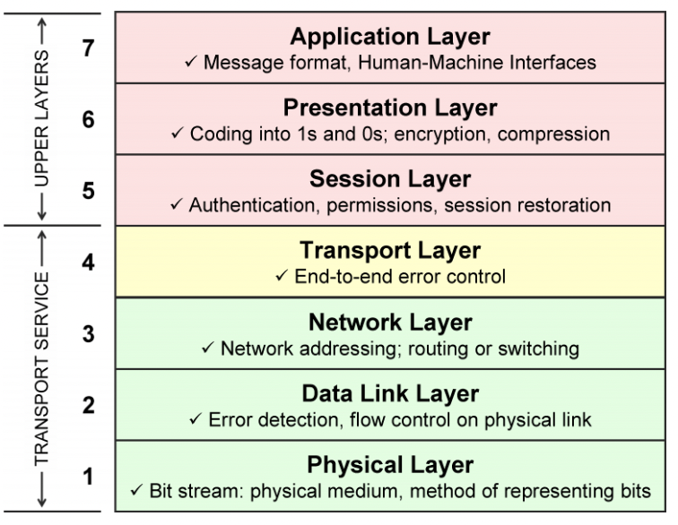

# 정리본

## 서버란?
클라이언트 요청에 대해 **적절한 응답을 주는 것**

---

## 프로토콜
**프로토콜(Protocol)**: 통신을 위해 정의된 형태 또는 규약을 의미

대표적인 프로토콜:
- **HTTP (HyperText Transfer Protocol)**
- **TCP (Transmission Control Protocol)**
- **UDP (User Datagram Protocol)**

---

## OSI 7계층
네트워크 통신의 과정을 7단계 계층으로 나눈 설계

| 계층 | 명칭 | 설명 |
|------|------------|-----------------------------------------------------------------|
| 7 | 응용 계층 (Application Layer) | 웹 서비스의 UI, 사용자 입출력(I/O) 담당 |
| 6 | 표현 계층 (Presentation Layer) | 계층 간 데이터 변환 및 표현 담당 |
| 5 | 세션 계층 (Session Layer) | 통신 세션 구성 및 관리 |
| 4 | 전송 계층 (Transport Layer) | 네트워크 데이터를 특정 포트(프로세스)로 전달 |
| 3 | 네트워크 계층 (Network Layer) | IP 주소를 사용해 데이터 전송 |
| 2 | 데이터 링크 계층 (Data Link Layer) | MAC 주소를 사용해 데이터 전송 |
| 1 | 물리 계층 (Physical Layer) | 디지털 데이터를 아날로그 신호로 변환하여 전송 |

---
## TCP/IP 4계층 모델
OSI 7계층 모델은 이론적인 표준 모델이며, 실제 인터넷 통신은 TCP/IP 프로토콜을 기반으로 한다.

| 계층 | 명칭 | 설명 |
|------|------------------------|-------------------------------------------------------------|
| 4 | 응용 계층 (Application Layer) | OSI 7계층의 7,6,5 계층 기능 담당 (HTTP, FTP, SSH 등 포함) |
| 3 | 전송 계층 (Transport Layer) | OSI 7계층의 4계층과 동일 (TCP, UDP 포함) |
| 2 | 인터넷 계층 (Internet Layer) | OSI 7계층의 3계층과 동일 (라우팅 담당) |
| 1 | 네트워크 인터페이스 계층 (Network Interface Layer) | OSI 7계층의 2,1 계층과 동일 (물리적 네트워크 포함) |

---

> **참고 자료**: [TCP/IP 계층 개념](https://ariz1623.tistory.com/327)

---

## HTTP vs HTTPS

| 구분 | HTTP | HTTPS |
|------|-----------------|-------------------------------|
| 프로토콜 | HyperText Transfer Protocol | HyperText Transfer Protocol Secure |
| 보안 | 암호화 없음 | SSL/TLS 암호화 사용 |
| 사용 목적 | 일반적인 웹 통신 | 보안이 중요한 웹사이트 (은행, 결제 등) |

**HTTPS(HTTP + SSL/TLS)**: HTTP 통신에 보안 계층(SSL/TLS)을 추가한 프로토콜로, 데이터를 암호화하여 안전한 통신을 보장한다.
