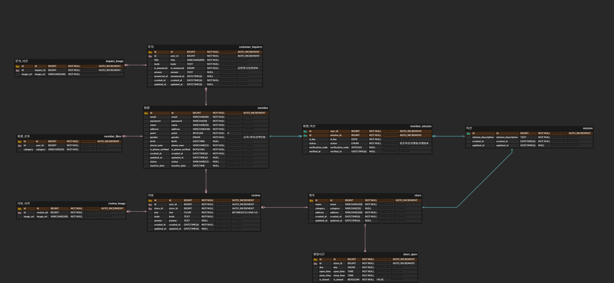

# 미션

## 요구사항

### 사용자 관련 요구사항

- 포인트를 조회할 수 있다.
- 계정을 탈퇴할 수 있다.
- 회원가입 정보는 다음과 같다
    - 이름, 성별(남,여,선택안함), 생년월일, 주소
    - 선호하는 음식의 종류를 선택할 수 있다. (중복 선택 가능)
- 마이페이지에서 볼 수 있는 회원 정보
    - 닉네임, 이메일, 휴대폰번호(인증/미인증), 내포인트

### 미션 관련 요구사항

- 미션과 관련하여 제공하는 정보는 다음과 같다.
    - 미션 조건(TEXT)가 존재한다.
    - 디데이가 존재한다.
    - 점포 주인에게 성공 요청을 할 수 있다.
    - 사장님 구분 번호가 존재한다.
    - 진행중/진행완료된 리뷰가 존재한다.
- 사용자 별로 몇개의 미션을 달성했는지 알 수 있다.
- 가게이름(카테고리), 미션조건, 디데이, 성공요청, 사장님 구분번호

### 리뷰 관련 요구사항

- 리뷰 내용은 다음과 같다
    - 닉네임, 식당명, 별점, 날짜, 리뷰 내용, 사진
    - 점포 주인이 답글을 달 수 있다.

### 가게 정보 요구사항

- 가게 정보는 다음과 같다
    - 식당명, 카테고리, 영업상태, 총 별점, 주소, 리뷰사진, 리뷰

### 문의 관련 요구사항

- 문의 제목, 문의 유형, 문의 내용, 사진첨부를 할 수 있다.
- 나의 문의 내역을 확인할 수 있다.
- 답변 대기중과 답변 완료 상태를 알 수 있다.

 

## ERD

 

# 시니어 미션

https://velog.io/@sunnin/UMC-제-123-정규화를-통해-ERD-설계해보자