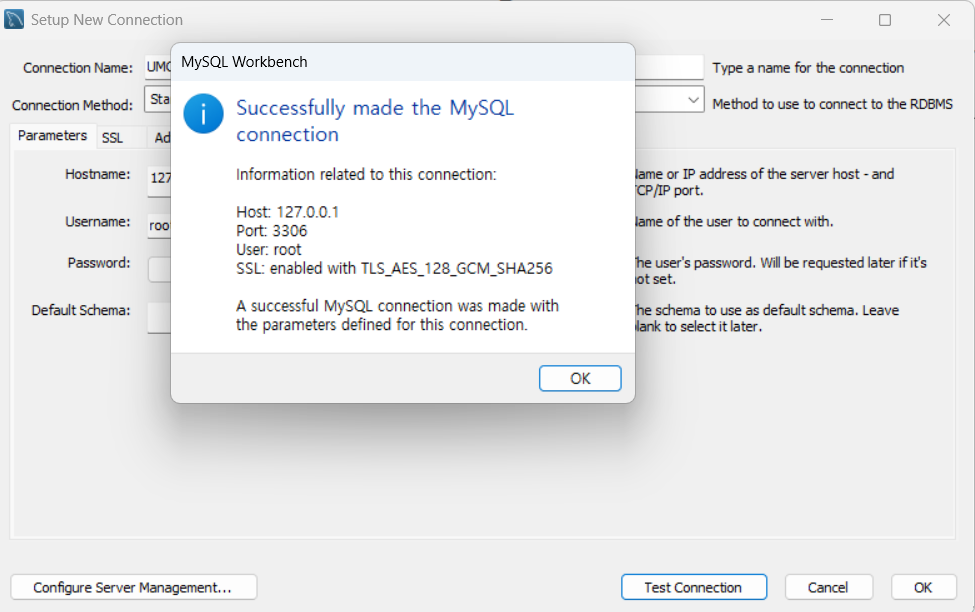

- 외래키
- 
  정의:
    - 한 테이블의 필드가 다른 테이블의 기본 키를 참조하여 테이블 간의 관계를 나타내는 키
  
  속성:
    - 데이터의 일관성과 무결성 유지
    - 테이블 간의 연관 관계 정의
  
  장점:
    - 데이터 무결성 보장
    - 테이블 간의 관계를 명확히 정의함
  
  단점:
    - 복잡한 관계 설정으로 인한 복잡도 증가
    - 외래키 제약 조건으로 인한 삽입, 삭제 작업의 성능 저하
  
- 기본키
- 
  정의:
    - 테이블 내에서 각 행을 고유하게 식별하는 하나 이상의 필드
  
  속성:
    - 각 행은 고유한 값을 가져야 한다.
    - NULL 값을 가질 수 없다.

  장점:
    - 데이터 무결성 보장
    - 인덱스로 사용되어 데이터 검색 속도를 향상시킴
  
  단점:
    - 여러 컬럼으로 구성된 복합 기본키는 관리가 어려움
  
- ER 다이어그램
- 
  정의:
    - 데이터베이스의 구조를 시각적으로 표현한 다이어그램
  
  속성:
    - 엔티티: 데이터베이스에서 저장되는 객체나 개념
    - 속성: 엔티티의 특성
    - 관계: 엔티티 간의 연관성
  
- 복합 키
- 
  정의:
    - 두 개 이상의 컬럼을 조합하여 하나의 기본키 역할을 하는 키
  
  속성:
    - 여러 컬럼의 조합으로 고유성 보장
    - 부분적 종속성 위험
  
- 연관관계
- 
  정의:
    - 두 개 이상의 엔티티 간의 관계를 나타낸다.
  
  속성:
    - 1:1, 1:N, N:M 등의 관계 유형을 가진다.
    - 단방향 또는 양방향 관계를 가진다.
  
- 정규화
- 
  정의:
    - 데이터 중복을 최소화하고, 데이터 무결성을 보장하기 위해 테이블을 구조화하는 과정
    - 1NF → 2NF → 3NF → BCNF → 4NF → 5NF 순서로 이루어져 있다.
  
  제 1 정규형(1NF):
    - 모든 컬럼이 원자값(Atomic value)만 가져야 한다.
    - 중첩된 테이블이나 다중 값이 존재하면 안된다.
  
  제 2 정규형(2NF):
    - 1NF를 만족해야 하며, 부분적 함수 종속을 제거해야 한다.
    - 복합키 테이블에서 일부 속성이 기본키의 일부에만 종속되면 안된다.
  
  제 3 정규형(3NF):
    - 2NF를 만족해야 하며, 이행적 종속을 제거해야 한다.
    - 기본키가 아닌 속성이 다른 기본키가 아닌 속성을 결정하면 안된다.

  BCNF:
    - 3NF를 만족해야 하며, 모든 결정자가 후보키가 되어야 한다.
  

- 반 정규화
- 
  정의:
    - 정규화된 데이터베이스에서 성능을 최적화하기 위해 일부 데이터 중복을 허용하는 과정
    - 조회 속도를 빠르게 하기 위해 일부 테이블을 병합하거나 중복 데이터를 추가할 수 있음

실습 인증 사진
