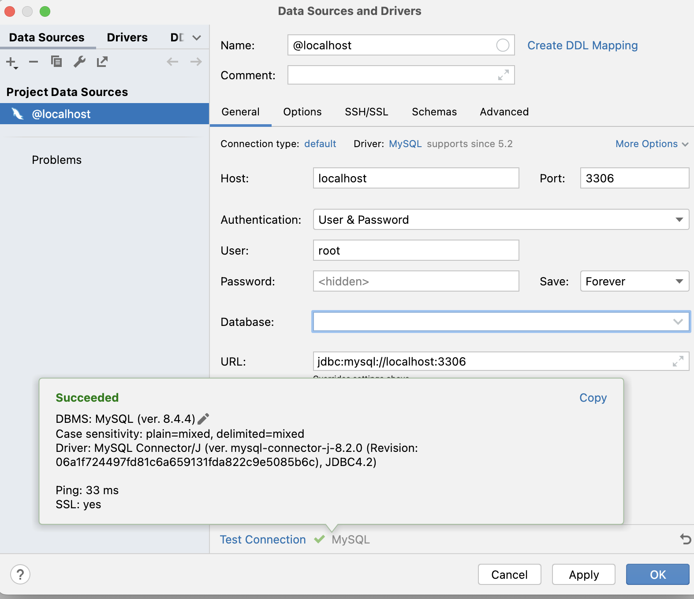
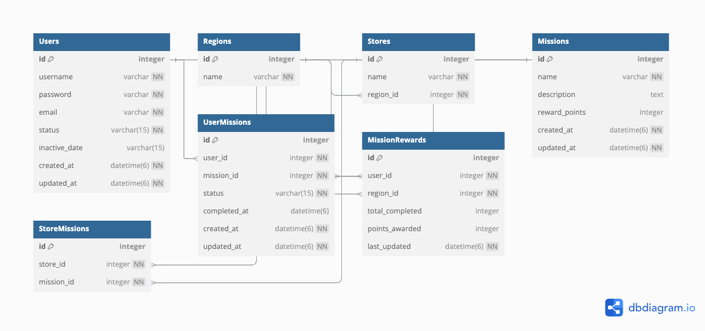

# 핵심 키워드 
# foreign key(외래 키)

  ### 정의

  데이터가 일관될 수 있도록 **돕는 역할**을 한다. 보통은 두 개의 데이터베이스 테이블을 잇고자 기본 키와 함께 사용된다.

  ⇒ 테이블을 **연결**하는 가상의 다리 역할!


  ### 특징

    1. 외부 키는 한 테이블의 필드로, 다른 테이블의 **기본키** 를 나타낸다.
    2. 외래 키를 가지고 있는 테이블을 하위 테이블, 기본 키를 가지고 있는 테이블을 **참조 테이블** 또는 **상위 테이블**이라고 한다.
    3. 각 외부 키와 기본 키는 1:1관계로 매칭되어야 하며, 기본 키에 존재하지 않는 값이 외부키에 존재할 수 없다. -> 외래 키 제한 표현으로 데이터베이스에게 두 테이블 간의 관계를 알려주어야 한다.

# Primary key(기본 키)

  ### 정의

  데이터베이스 테이블 내의 모든 레코드에서 **고유한 아이디**를 제공하는 것

  ### 특징

    1. 모든 레코드가 서로 다른 값을 가지고 있어 각 레코드를 식별할 수 있다.
    2. NULL값이 존재할 수 없다.
    3. 레코드의 값은 **중복이 불가능**하다.
    4. 테이블에는 하나의 기본키만 가질 수 있지만 경우에 따라 1개 이상의 기본키를 정의할 수도 있다. (다수 열 기본 키, 복합 기본 키)

  ### 활용 예시
    CREATE TABLE user {
    	id int PRIMARY KEY //PK로 사용하기를 원하는 컬럼에 PRIMARY KEY 붙여주기
       }

  * AUTO_INCREMENT

    - PRIMARY KEY의 속성 중 하나
    - 레코드에 유니크한 값을 자동 부여 ⇒ 1부터 증가하며 값을 부여하는 방식 
  
# ER 다이어그램
  ### **ERD** (Entity-Relationship Diagram)란?

  ER모델을 이용해 현실 세계를 개념적으로 모델링한 결과물을 그림으로 표현한 것

  ### **개체-관계 모델(E-R model)이란?**

  개념적 데이터 모델로써 개체와 개체 간의 관계를 이용하여 현실 세계를 표현한 것

  핵심 요소: **개체, 속성, 관계**

    </aside>

    - **개체 (entity)**
        - 사람이나 사물, 개념, 사건 등 다른 개체와 구별되는 모든 것
        - 사각형으로 표현

    - **속성 (Attribute)**
        - 개체나 관계가 가지고 있는 고유한 특성
        - 타원으로 표현
        - 추가적으로 분류가 가능함!
        - 대표적 종류 : 단순 속성, 복합 속성, 키 속성
        - 단순 속성 : 의미를 더 분해할 수 없는 속성
            - ex) 고객 아이디
        - 복합 속성 : 의미를 분해할 수 있는 속성 => **속성에 속성**을 표현
            - ex) 주소 : 시, 도, 군, 면 등등으로 추가 분해가 가능
        - 키 속성
            - 각 개체 인스턴스를 식별(구별)하는 데 사용되는 속성

          **⇒ 속성 이름에 밑줄로 표시!!**

    - **관계(Relationship)**
        - 개체와 개체가 맺고 있는 관계(연관성) or 개체 집합 사이의 대응관계(매핑)를 뜻함

      ⇒  **마름모**로 표현

        - ex) 고객과 책 “개체”는 구매라는 “관계”를 가지고 있다.
        - 관계의 종류 : 1:1, 1:n, n:m관계
# Composite key (복합키)
- 
- 두개 이상의 컬럼으로 구성된 하나의 기본키.
- 기본키는 하나의 테이블에 하나만 존재할 수 있다, 또한 기본키는 하나 이상의 컬럼으로 구성되어 있다.
    - 기본키가 만약 복합키라면, 복합키 또한 당연히 **유일성과 최소성**을 만족해야한다.

  ### 복합키를 왜 사용해야하는가?

  1. **데이터 무결성 보장**: 복합키를 사용하면, 한 테이블 내의 특정 칼럼 조합의 고유성을 보장할 수 있습니다. 이를 통해 데이터 중복을 방지하고 무결성을 유지할 수 있습니다.
  2. **정규화**: 복합키는 데이터베이스 설계의 정규화 과정에서 발생하는 테이블 간의 관계를 나타내는 데 유용하게 사용

     ex) 각 대여 정보를 구분하기 위해 '도서관 코드'와 '도서 코드' 두 개의 칼럼을 결합하여 복합키를 생성하는 방식(sql을 활용한 예시)

      ```jsx
      -- 대여 정보 테이블 생성
      CREATE TABLE InternationalBookRental (
          libraryCode VARCHAR(10),
          bookCode VARCHAR(10),
          rentalDate DATE,
          returnDate DATE,
        
          PRIMARY KEY (libraryCode, bookCode)
          // libraryCode와 bookCode의 조합으로 복합키를 생성
      );
        
      -- 대여 정보 입력 예시
      INSERT INTO InternationalBookRental (libraryCode, bookCode, rentalDate) 
      VALUES ('LIB123', 'BK001', '2023-01-01');
# 연관관계

  ### **엔터티 연관 관계의 종류와 구현 방법**

  - Entity에서는 상대 Entity를 참조하여 Entity 사이의 연관관계를 맺을 수 있음.

  ## 1:1 관계 (One-to-One)

- **한 테이블의 레코드가 다른 테이블의 레코드와 1:1로 연결될 때**
    - ex) 고객과 고객의 프로필 관계

    ```jsx
    -- 사용자 테이블
    CREATE TABLE User (
        UserID INT PRIMARY KEY,
        Username VARCHAR(100)
    );
    
    -- 프로필 테이블
    CREATE TABLE Profile (
        ProfileID INT PRIMARY KEY,
        UserID INT,
        Address VARCHAR(255),
        FOREIGN KEY (UserID) REFERENCES User(UserID)
    );
    ```


## 1: n 관계 : One-to-Many

- **한 테이블의 레코드가 다른 테이블의 여러 레코드와 연결될 때**

ex) Customer와 Orders 관계

## n:m 관계 (Many-to-Many)
    
- **여러 테이블이 서로 다수의 레코드와 연결될 때.**

⇒ join 테이블 사용!

```jsx
//학생 테이블과 수업 테이블이 있을 때
-- 학생-수업 조인 테이블
CREATE TABLE StudentCourse (
    StudentID INT,
    CourseID INT,
    FOREIGN KEY (StudentID) REFERENCES Student(StudentID),
    FOREIGN KEY (CourseID) REFERENCES Course(CourseID),
    PRIMARY KEY (StudentID, CourseID)
);
```

# 정규화(Normalization)

  ### 비정규 릴레이션의 문제

  비정규 릴레이션에서는 **데이터의 중복, 무결성 문제, 업데이트 이상, 삭제 이상, 삽입 이상** 등이 발생할 수 있다. 이러한 문제들은 데이터베이스 설계에 있어 효율성을 떨어뜨리고, 데이터 일관성을 유지하는 데 어려움을 겪게 만든다. 이러한 문제를 해결하기 위해 정규화가 필요하다. 정규화는 테이블을 분리하여 중복을 최소화하고, 데이터 무결성을 확보하며, 이상 현상을 방지하는 역할을 한다.

- 1NF : 하나의 속성 안에는 하나의 값만 입력되어야한다.
- 2NF : 1NF을 만족하는 테이블 중에서 복합 키로 기본 키가 구성되어있는 경우 ⇒ 부분함수형 종속이 있는지 확인
    - 있을 경우 제거하여 완전함수형 종속으로 만드는 것
- 3NF : 2정규형을 만족하는 테이블 중에서 A면 B고 B면 C이다 라는 이행적 함수종속을 만족하면 테이블을 분리해 이행적 함수종속을 없애버림
# 반 정규화(Denormalization)
  - 반 정규화 : 성능을 향상시키기 위해 일부러 정규화된 데이터베이스 구조를 다시 비정규화하여 데이터 중복을 허용하는 데이터 모델링의 기법
      - 성능은 향상될 수 있으나, 데이터 무결성이 깨질 수 있음

### 왜 반정규화를 하는 걸까?

  - 데이터를 조회할 때 조인으로 인한 성능저하가 예상될 때 성능이 저하될 것이 예상되는 경우
      - 주로 읽기 성능을 향상시키기 위해서 사용, 데이터 중복이 허용될 수 있는 경우 유용

### 반정규화 사용 대표적인 예시

  - **문제 상황:** 쇼핑몰 사이트에서 사용자의 주문 내역을 조회할 때, `주문 테이블(Order)`, `고객 테이블(Customer)`, `상품 테이블(Product)`을 조인해야 한다. 이 경우, 각 테이블에 대해 매번 조인 연산이 이루어져 성능 저하가 발생할 수 있다.
  - **반정규화 해결:** 주문 테이블에 고객 이름과 상품 정보를 중복 저장하여, 주문 내역을 조회할 때 추가적인 조인 없이 주문 테이블만 조회하도록 반정규화한다.

      ```jsx
      기존 테이블:
      - 주문 테이블(Order): 주문 ID, 고객 ID, 상품 ID, 주문 날짜
      - 고객 테이블(Customer): 고객 ID, 고객 이름
      - 상품 테이블(Product): 상품 ID, 상품 이름
      
      반정규화된 테이블:
      - 주문 테이블(Order): 주문 ID, 고객 이름, 상품 이름, 주문 날짜
      
      ```
    
# 실습 인증

# 미션 인증
- **`Users`**: 회원 정보 저장
    - `Users` 테이블에 `status` 및 `inactive_date` 컬럼을 `varchar(15)`로 설정

      ⇒ soft delete(HTTP Method 중 Patch)를 위해서

- **`Regions`**: 지역별 데이터 저장
- **`Stores`**: 특정 지역 내 가게 정보 저장
- **`Missions`**: 미션 정보 저장 (보상 포인트 포함)
- **`StoreMissions`**: 특정 가게에서 수행 가능한 미션 저장
- **`UserMissions`**: 사용자의 미션 수행 상태 저장 (`ongoing`, `completed`)
    - `created_at` 및 `updated_at`을 `datetime(6)`으로 적용

      ⇒ 최신순 정렬 기능을 위해서(**MySQL 기준 6자리가 최대 / (6)은 밀리초 소수점 6자리까지 구분한다는 의미)**

- **`MissionRewards`**: 특정 지역에서 10개 미션 완료 시 1000 포인트 지급 트래킹

