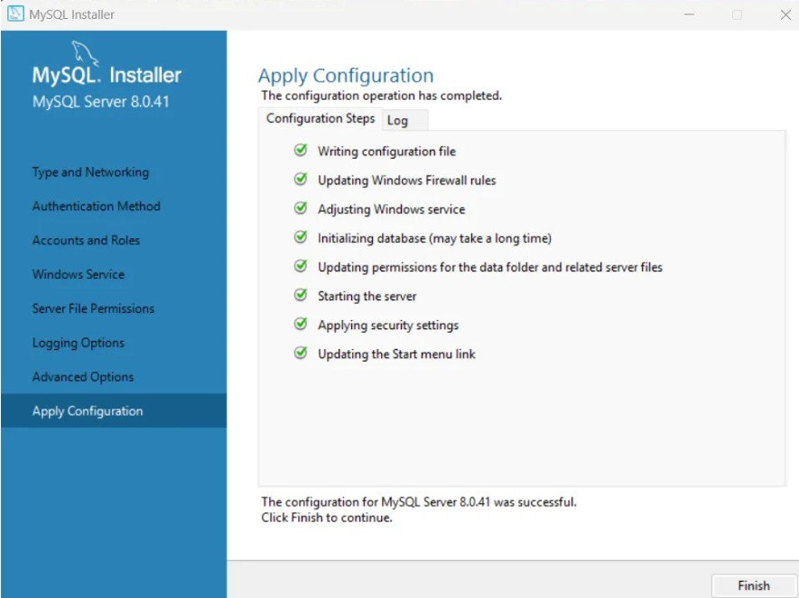
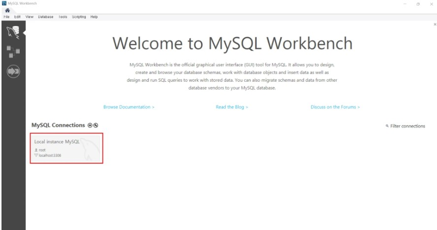
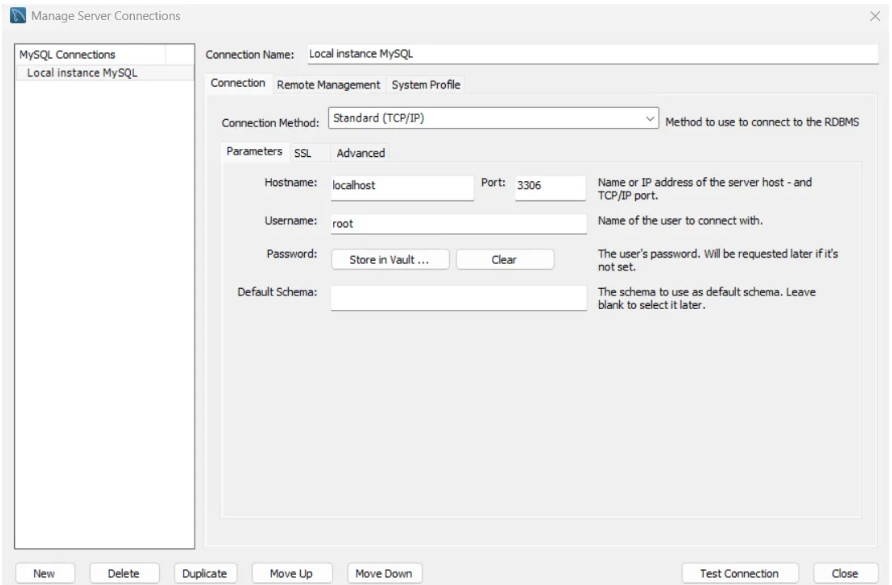
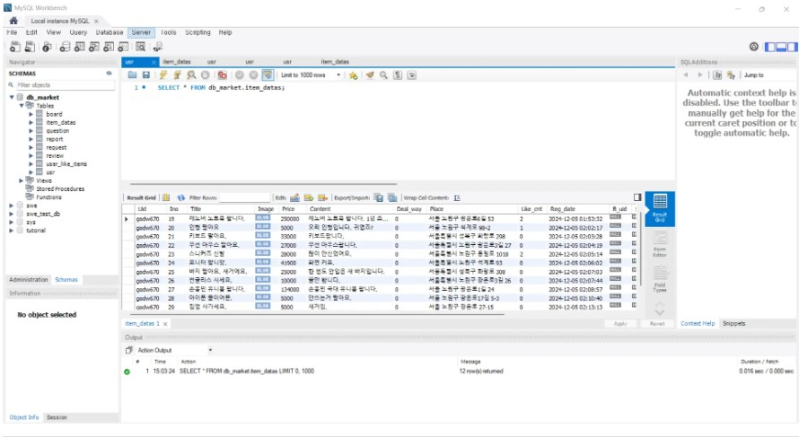
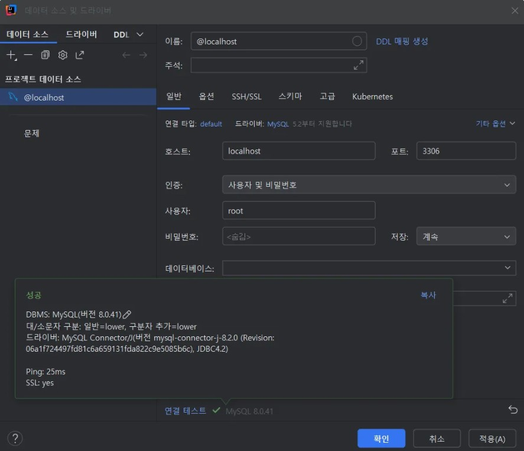

# WEEK 1 - 동우/고동우
## 핵심 키워드

- ### 외래키

외래키는 Foreign Key(FK)로 한 테이블에서 다른 테이블의 Primary Key(PK)를 참조할 때 쓰인다.

어떤 테이블에서 외래키가 있다는 것은 그 테이블이 참조하는 테이블과 관련이 있다는 것이다.

두 테이블 사이의 관계는 1:N, N:M 관계이다. 예를 들어, 중고 장터 웹에서 사용자가 장바구니에 담은 물품은 사용자 한 명이 여러 개의 물품을 담을 수 있고, 한 물품을 여러 명의 사용자가 담을 수 있으므로 N:M 관계이다.

내가 생각하는 외래키를 정할 때 가장 중요한 것은 테이블 간의 관계라고 생각한다. 두 테이블 간의 공통된 관계를 가장 잘 설명할 수 있는 속성을 외래키로 만들어야 테이블을 사용할 때 데이터를 찾기 좋다.
- ### 기본키

기본키(Primary Key)는 한 테이블 안에서 서로 다른 튜플들을 구별할 때 사용된다. 기본키는 한 테이블 안의 모든 데이터를 구별할 수 있게 하기 때문에 이것을 고려해서 알맞은 속성을 기본키로 지정해야한다. 나는 주로 데이블을 가장 잘 설명할 수 있는 속성을 기본키로 지정하는 편이다.

하지만 위에서는 모든 테이블에서 index로 id를 만들어서 기본키로 사용하는 것이 편하다고 되었있었다. 나는 이러한 방식으로 기본키를 정의해본 적이 없어서 처음에는 왜 이렇게 해야하지? 란 생각이 들었다.

생각을 해보면 나도 테이블에서 고유한 데이터(튜플)을 읽어올 때, 따로 고유한 코드를 부여하도록 설계한 경우가 있었다. 이것을 생각해봤을 때는 id로 index를 통일하는 방법도 편리하다고 생각이 되었다.
- ### ER 다이어그램

ER 다이어그램은 Entity-Relation 다이어그램이다. 이름에서 알 수 있듯이, 객체와 관계를 사용하여 데이터베이스를 표현하는 다이어그램이다. ER 다이어그램은 데이터베이스에서 테이블간의 관계를 이해하거나 구조를 이해할 때 사용한다. ER 다이어그램을 내가 직접 그려보기도 했었고, MySQL에서 자동으로 만들어보기도 했다. ER 다이어그램을 사용하면 테이블 간의 관계를 한 눈에 볼 수 있어서 편리했다.
- ### 복합키

복합키(Composite Key)는 둘 이상의 속성을 결합하여 기본키를 생성한다. 복합키는 하나의 속성만으로 테이블의 데이터들을 개별적으로 식별할 수 없는 경우 사용된다.

복합키는 복잡한 관계를 가진? 하나의 속성으로 데이터를 정의하기 힘든? 테이블에서 사용된다.
- ### 연관관계

연관관계(Relationship)은 ER 다이어그램에서 두 개 이상의 엔티티(Entity) 간의 관계를 나타낸다.

연관관계에는 1:1, 1:N, M:N이 있다. ER 다이어그램을 그려봤을 때, 가장 중요한 것은 연관관계로 테이블 간의 관계를 나타내는 것이라고 생각한다. 테이블 간의 연관관계를 알 수 있으면 테이블과 데이터 이해도 쉬워지고, 쿼리 작성도 편했었다. 쿼리 작성이 편하다는 것은 한 테이블의 데이터을 참고해서 다른 테이블의 데이터를 가져오는 것과 같이 테이블 간의 연관된 데이터를 사용해야할 때, 연관관계를 쿼리에서 사용하는 경우가 있어서 그렇게 생각했다.
- ### 정규화

**정규화(Normalization)** 는 데이터의 중복을 최소화하고 데이터 무결성을 유지하기 위해 데이터를 구조화하는 과정이다.

1. 제 1정규형 (1NF)

- **1NF**는 "각 열에 원자값이 들어 있어야 한다"는 규칙입이다. 하나의 셀에는 하나의 값만 들어가야 한다.

2. 제 2정규형 (2NF)

- **2NF**는 **1NF를 만족하고**, 모든 비기본 속성이 **기본키에 완전 함수적 종속**이어야 한다.

3. 제 3정규형 (3NF)

- **3NF**는 **2NF를 만족하고**, 모든 비기본 속성이 **기본키에 이행적 종속**되지 않아야 한다는 규칙이다.

4. 보이스-코드 정규형 (BCNF)

- **BCNF**는 **3NF를 만족하고**, 모든 결정자가 기본키여야 한다는 규칙이다.

5. 제 4정규형 (4NF)

- **4NF**는 **BCNF를 만족하고**, 다치 종속(Multivalued Dependency)을 없애는 규칙이다

6. 제 5정규형 (5NF)

- **5NF**는 **4NF를 만족하고**, 조인 종속(Join Dependency)이 없는 상태여야 한다는 규칙이다.
- ### 반정규화

반정규화(Denormalization)는 정규화와 반대로, 데이터베이스에 중복된 데이터을 허용하여 성능을 개선한다. 정규화는 데이터를 나눠 중복을 줄이고 데이터의 무결성을 높이지만, 테이블과 데이터가 많아지게 되어 테이블 간 조인을 통해 데이터를 읽어와야 하는 경우에 시간이 오래걸리게 된다.

### 로컬 DB 세팅 실습

### DB 접속

#### + IntelliJ IDEA에서 MySQL 연동하기
