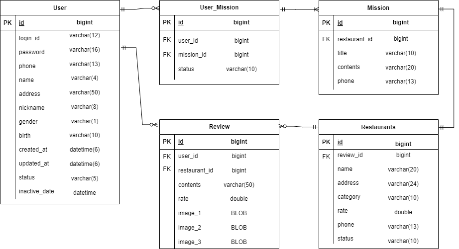

# WEEK1 - 동우/고동우
## 미션
### - 데이터베이스 설계해보기

### 테이블

**User**

- 앱 사용자의 정보를 가지고 있는 테이블
- **연관관계:** User_Mission과 1:N, Reivew와 1:N

**Restaurants**

- 음식점의 정보를 가지고 있는 테이블
- **연관관계:** Review와 1:N, Mission과 1:1

**Mission**

- 미션의 목록
- **연관관계:** User_Mission과 N:1, Restaurants과 1:1

**User_Mission**

- 사용자의 미션 목록. 수행 완료한 미션과 수행 중인 미션.
- 연관관계: User와 N:1, Mission과 1:N

**Review**

- 사용자가 남긴 리뷰들
- 연관관계: User와 N:1, Restaurants과 N:1

### ER 다이어그램

