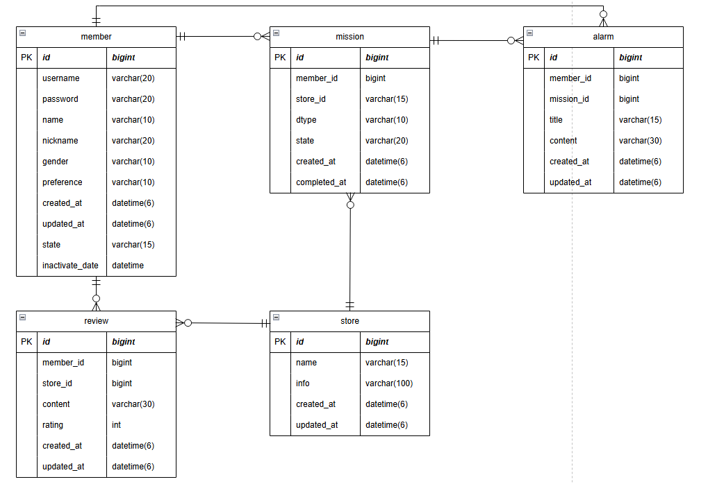

1. 필요한 엔티티 설정 - member, mission, review, store, alarm
2. 연관관계 설정

   2-1) member와 mission은 1:N 관계(하나의 mission을 여러 member가 가질 수 없음)

   2-2) store과 mission은 1:N 관계

   2-3) mission과 alarm은 1:N 관계

   2-4) member와 review는 1:N 관계

   2-5) store과 review는 1:N 관계

   2-6) member와 alarm은 1:N 관계

3. 각 엔티티의 필드 설정 및 연관관계 연결
