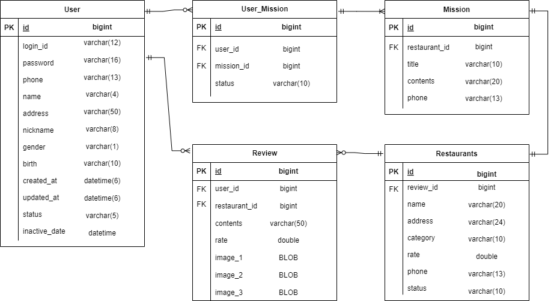
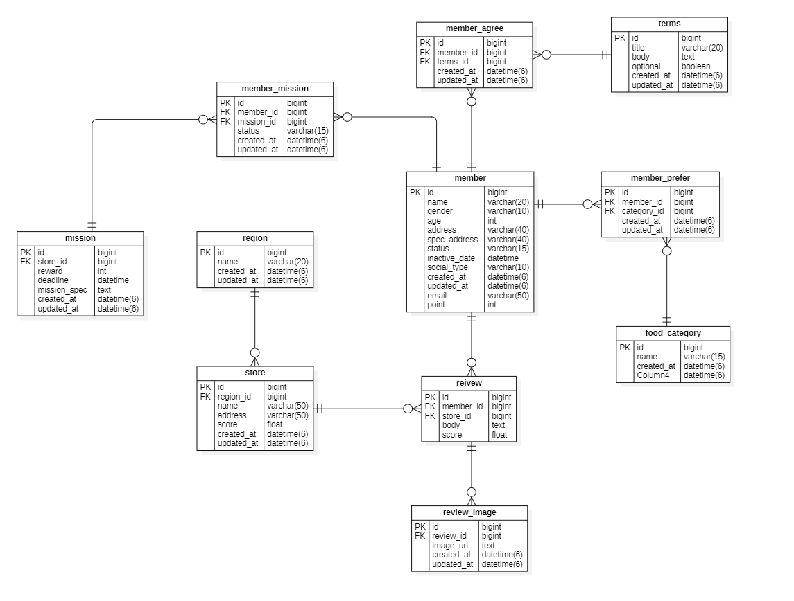

## **1주차에서 설계한 ERD**



User 테이블의 gender는 enum(’male’, ‘female’), status는 enum(’active’, ‘offline’, ‘inactive’)로 수정한다.

User_Mission 테이블의 status는 enum(’Incomplete’, ‘ongoing’, ‘complete’)로 수정한다.

Restaurants 테이블의 status는 enum(’open’, ‘close’)로 수정한다.

## **2주차 미션**

이번 미션에서는 본문에 나왔는 테이터베이스를 사용했다. 내 데이터베이스를 수정해서 사용하고 싶었는데 다른 할 일도 많고 솔직히 다시 그리기 귀찮…아서…주어진 데이터베이스를 사용했다.



### 1. **내가 진행 중, 진행 완료한 미션을 모아서 보는 쿼리 (페이징 포함)**

```sql
SELECT ms.reward, mm.status, s.name, ms.mission_spec
FROM member_mission AS mm
LEFT JOIN mission AS ms ON mm.mission_id = ms.id
LEFT JOIN member AS mb ON mm.member_id = mb.id
LEFT JOIN store AS s ON ms.store_id = s.id
WHERE mb.id = (value)
  AND mm.id < (last_cursor_id)
ORDER BY mm.id DESC
LIMIT 10;
```

가져와야 하는 데이터는 내 포인트, 미션 정보, 미션 장소가 있다.

먼저 내가 진행 중, 진행 완료한 미션을 가져와야 하기 때문에 member_mission 테이블과 member 테이블을 LEFT JOIN해서 내 미션 데이터를 가져와야 한다고 생각했다.

여기에 미션의 장소(음식점) 정보도 필요하다고 생각해서 LEFT JOIN으로 추가했다.

Cursor paging 기법으로 마지막에 조회된 member_mission의 id를 사용해서 5개씩 데이터를 가져왔다.

쿼리를 작성하고 보니까 JOIN이 많아서 복잡해보였다. 따로 인덱스를 지정해서 사용하면 복잡한게 줄어들 것 같다.

### 2. **리뷰를 작성하는 쿼리 (사진 배제)**

```sql
INSERT INTO review (member_id, store_id, created_at, body, score)
VALUES (?, ?, ?, ?)
(= VALUES (11, 15, ‘광운대 맛집 이층집’, 5) )
```

리뷰 작성에서는 네임(닉네임, 아마 id), 장소(음식점), 날짜, 별, 리뷰 본문이 필요하다. id는 아마 auto increment 이런 옵션으로 자동으로 되어있을 것 같아서 뺏다. 날짜는 없지만 그냥 넣었다. 아마 자동으로 계산되서 들어갈 거라고 생각했다.

### 3. **홈 화면 쿼리 (현재 선택된 지역에서 도전이 가능한 미션 목록, 페이징 포함)**

```sql
SELECT r.name, ms.status, s.name, s.address, ms.reward
FROM member_mission AS mm
LEFT JOIN mission AS ms ON mm.mission_id = ms.id
LEFT JOIN store AS s ON ms.store_id = s.id
LEFT JOIN region AS r ON s.region_id = r.id
WHERE mm.member_id = (value)
  AND mm.status = '진행 중'
  AND mm.id < (last_cursor_id)
ORDER BY mm.id DESC
LIMIT 10;
```

홈 화면에서는 지역이름, 식당의 주소, 모든 미션의 개수, 미션의 보상이 있어야 한다고 생각했다.

먼저 나의 미션을 member와 member_mission을 LEFT JOIN하여 가져온다.

여기에 해당 mission의 store와 region을 JOIN하여 식당과 위치 정보를 가져온다.

### 4. **마이 페이지 화면 쿼리**

```sql
SELECT name, email, phone, point
FROM member
WHERE id = (value)
```

마이 페이지에서 필요한 데이터는 닉네임, 이메일, 휴대폰 번호, 내 포인트가 있다. 이는 member 테이블에 모두 존재해서 그 값만 가져오게 작성했다.

phone 데이터는 없는데 그냥 추가했다.