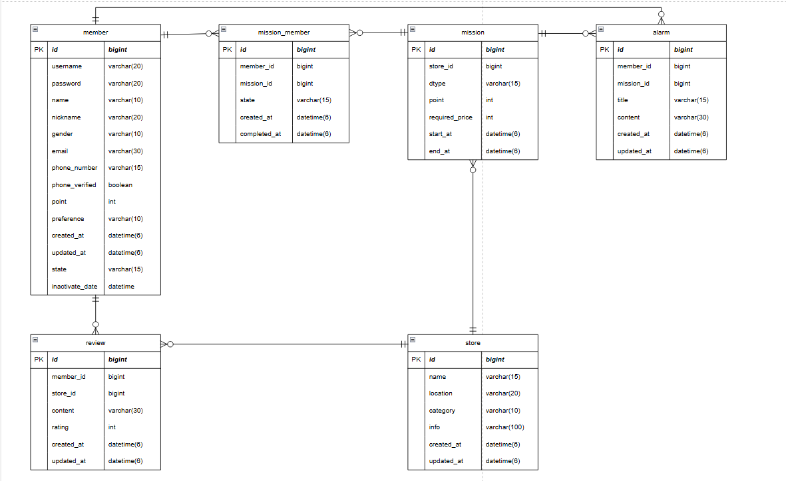

# 1주차 때 설계한 데이터베이스를 토대로 쿼리 작성
## 1주차 미션

### 1. 내가 진행중, 진행 완료한 미션 모아서 보는 쿼리(페이징 포함)
#### - mission의 state를 통해 진행중/ 진행 완료 구분
#### -> 준비됨: ready, 진행중: active, 완료됨: completed
#### - 미션의 기준 가격, 포인트, 가게 이름 조회
```sql
-- 진행중인 미션 조회
-- 먼저 진행을 시작한 미션부터 조회되도록 커서 기반 페이징
-- created_at과 mission_member_id를 정렬 기준으로 사용

select m.required_price, m.point, s.name 
from mission m 
join mission_member mm on m.id = mm.mission_id
join store s on m.store_id = s.id
where mm.member_id = 1
  and mm.state = 'active'
  and (
    mm.created_at > {last_created_at}
    or (mm.created_at = {last_created_at} and mm.id > {last_mm_id})
  )
order by mm.created_at asc, mm.id asc
limit 10;
```
```sql
-- 진행 완료 미션 조회
-- 먼저 완료한 미션부터 조회되도록 커서 기반 페이징
-- completed_at과 mission_member_id를 정렬 기준으로 사용

select m.required_price, m.point, s.name
from mission m
join mission_member mm on m.id = mm.mission_id
join store s on m.store_id = s.id
where mm.member_id = 1
  and mm.state = 'completed'
  and (
    mm.completed_at > {last_completed_at}
    or (mm.completed_at = {last_completed_at} and mm.id > {last_mm_id})
  )
order by mm.completed_at asc, mm.id asc
limit 10;
```
### 2. 리뷰 작성 쿼리
#### - 멤버, 가게, 리뷰 내용, 리뷰 평점, 작성 날짜 설정
```sql
insert into review (member_id, store_id, content, rating, created_at)
values(1, 1, '너무 맛있어요', 5, now());
```
### 2-1. 리뷰 조회 쿼리
#### - 닉네임, 리뷰 내용, 리뷰 평점, 작성 날짜 조회
```sql
select m.nickname, r.content, r.rating, r.created_at
from review r
join member m on m.id = r.member_id
where r.store_id = 1;
```
### 3. 홈 화면 쿼리(현재 선택된 지역에서 도전이 가능한 미션 목록, 페이징 포함)
#### - 해당 지역의 미션 중 진행하기 이전 상태의 미션 조회
#### - 가게 이름, 가게 카테고리, 미션 기준 가격, 포인트 조회
```sql
-- 가게 이름, 카테고리, 미션 기준 가격, 포인트 조회
-- 오래된 미션부터 조회되도록 커서 기반 페이징
-- start_at과 mission_id를 페이징 정렬 기준으로 사용

select s.name, s.category, ms.required_price, ms.point
from member mb
join mission_member mm on mm.member_id = mb.id
join mission ms on ms.id = mm.mission_id
join store s on s.id = ms.store_id
where mb.id = 1
  and mm.state = 'ready'
  and s.location = '선택 지역'
  and (
    ms.start_at > {last_start_at}
    or (ms.start_at = {last_start_at} and ms.id > {last_mission_id})
  ) 
order by ms.start_at asc, ms.id asc
limit 10;
```
### 4. 마이 페이지 화면 쿼리
#### - 닉네임, 이메일, 휴대폰 번호, 휴대폰 인증 여부, 포인트 조회
```sql
select nickname, email, phone_number, phone_verifed, point
from member
where id = 1;
```