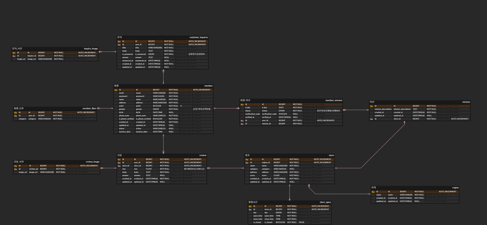

# 미션

## ERD 

<br>

## 1번
```
SELECT
    s.name,
    m.mission_spec,
    m.reward
FROM (
    SELECT member_id, mission_id
    FROM member_mission
    WHERE status = '진행중'
      AND member_id = {member_id}
      AND CONCAT(LPAD(member_id, 10, '0'), LPAD(mission_id, 10, '0')) > 
      CONCAT(LPAD({member_id}, 10, '0'), LPAD(0, 10, '0'))  -- cursor value 
    ORDER BY CONCAT(LPAD(member_id, 10, '0'), LPAD(mission_id, 10, '0'))  -- 오름차순
    LIMIT 15
) AS mm
JOIN mission m ON mm.mission_id = m.id
JOIN store s ON m.store_id = s.id;
```

## 2번
```
SELECT 
    m.name AS member_name,
    r.created_at,
    r.star,
    r.body,
    s.name AS store_name
FROM member m
JOIN review r ON r.user_id = m.id
JOIN store s ON r.store_id = s.id
WHERE m.id = :user_id;
```

## 3번
```
SELECT 
    m.id AS mission_id,
    s.name AS store_name,
    m.mission_description,
    m.reward,
    m.created_at
FROM mission m
JOIN store s ON m.store_id = s.id
JOIN region r ON s.region_id = r.id
LEFT JOIN member_mission mm 
    ON mm.mission_id = m.id AND mm.user_id = 123
WHERE r.name = '안암동'
  AND mm.mission_id IS NULL  -- 유저가 아직 도전하지 않은 미션
  AND (:created_at IS NULL OR m.created_at < :created_at) -- cursorvalue
ORDER BY m.created_at DESC
LIMIT 7;
```

## 4번
```
SELECT 
    m.name, 
    m.email, 
    m.phone_num, 
    m.is_phone_verified, 
    m.point
FROM member m
WHERE m.id = 123;
```


# 시니어 미션
https://velog.io/@sunnin/UMC-좋은-쿼리는-어떻게-작성할-수-있을까