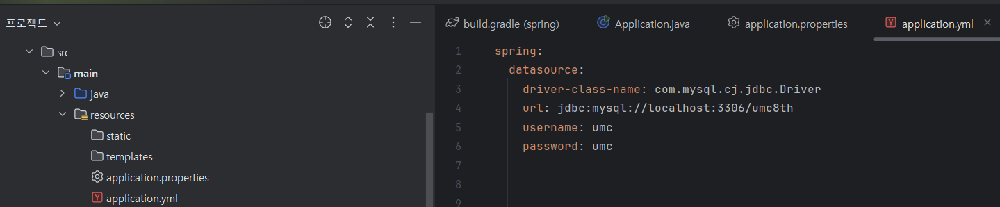
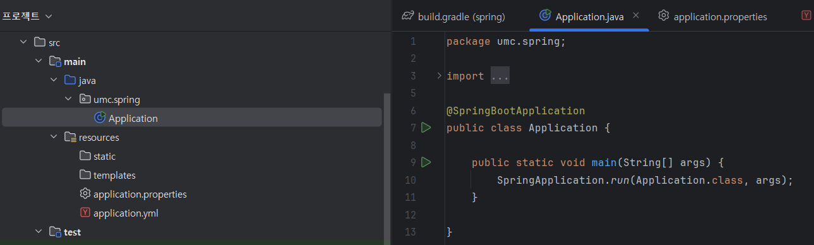
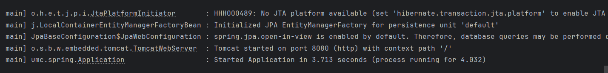
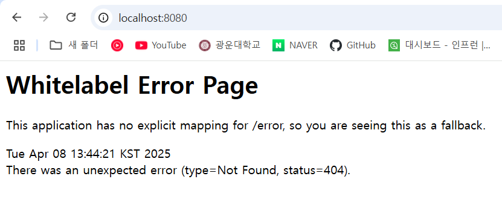
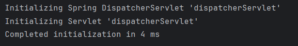

## 📁 프로젝트 구조 및 실행

### 1. application.yml

- 위치: `src/main/resources/application.yml`
- 설정 파일로, 서버 포트, DB 설정, 스프링 설정 등을 작성하는 곳

---

### 2. Application.java

- 위치: `src/main/java/umc/spring/Application.java`
- 스프링 부트 애플리케이션의 진입점 (main 메소드)
- 실행 시 내장 Tomcat 서버가 구동됨

---

## 🚀 애플리케이션 실행 결과

- 실행이 완료되면 8080 포트에서 Tomcat이 시작됨

  
---
## 🔄 HTTP 요청 처리 흐름
### 1. 사용자가 브라우저에서 접속
- localhost:8080 포트의`/` 경로로 **HTTP GET 요청** 전송
### 2. DispatcherServlet에 요청 전달

- `DispatcherServlet`은 **스프링의 프론트 컨트롤러**
- 모든 HTTP 요청을 가장 먼저 받음

### 3. DispatcherServlet의 역할

- `HandlerMapping`을 통해 해당 요청을 처리할 컨트롤러 메소드를 탐색
- 매핑된 **컨트롤러 메소드 호출**

### 4. 컨트롤러 메소드 실행

- 요청을 처리하고 결과를 반환 (예: `String`, `ModelAndView`, `JSON` 등)

### 5. ViewResolver 처리

- 반환된 결과를 기반으로 뷰 리졸버(ViewResolver)가 적절한 뷰로 변환

### 6. 응답 반환

- 최종 결과를 HTTP Response로 클라이언트(브라우저)에게 전송

---

## ⚠️ 기본 에러 페이지 반환

- `/` 경로에 해당하는 컨트롤러 메소드나 정적 리소스가 정의되지 않음
- 스프링 부트는 기본적으로 기본 에러 페이지를 반환

  

---

## 📌 DispatcherServlet 특징

- `DispatcherServlet`은 스프링이 시작될 때 한 번만 생성
- 싱글톤으로 관리되어 애플리케이션이 종료될 때까지 계속 유지됨
- 이후 동일한 경로로 요청이 와도, 새로운 인스턴스를 생성하지 않음
- 이는 스프링의 핵심 원칙 중 하나인 "한 번 등록, 계속 사용"에 해당함
- 결과적으로 효율적이고 일관된 요청 처리가 가능해짐

  
