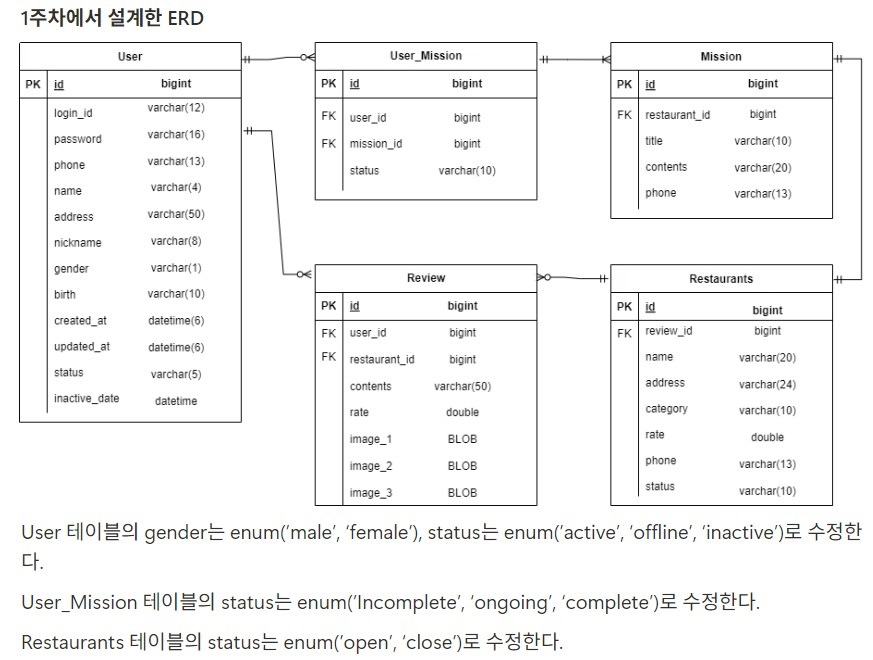
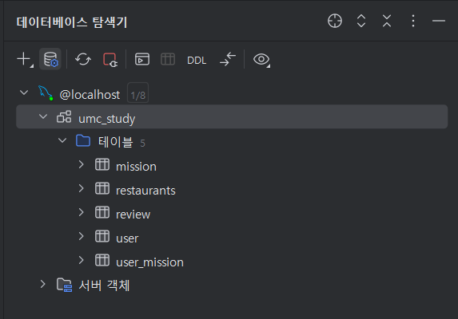

**ERD**



**User**

```java
@Entity
@Getter
@Builder
@NoArgsConstructor(access = AccessLevel.PROTECTED)
@AllArgsConstructor
public class User extends BaseEntity {
    @Id
    @GeneratedValue(strategy = GenerationType.IDENTITY)
    private Long id;

    @Column(name = "login_id", length = 12, nullable = false)
    private String loginId;

    @Column(length = 16, nullable = false)
    private String password;

    @Column(length = 13)
    private String phone;

    @Column(length = 4)
    private String name;

    @Column(length = 50)
    private String address;

    @Column(length = 8)
    private String nickName;

    @Enumerated(EnumType.STRING)
    @Column(columnDefinition = "VARCHAR(5)")
    private Gender gender;

    @Column(length = 10)
    private LocalDate birth;

    @Enumerated(EnumType.STRING)
    @Column(columnDefinition = "VARCHAR(10) DEFAULT 'ACTIVE'")
    private UserState state;

    @Column(name = "inactive_date")
    private LocalDate inactiveDate;

    @OneToMany(mappedBy = "user")
    private List<UserMission> userMissions;
}
```

**UserMission**

```java
@Entity
@Getter
@Builder
@NoArgsConstructor(access = AccessLevel.PROTECTED)
@AllArgsConstructor
public class UserMission {

    @Id
    @GeneratedValue(strategy = GenerationType.IDENTITY)
    private Long id;

    @ManyToOne(fetch = FetchType.LAZY)
    @JoinColumn(name = "user_id")
    private User user;

    @ManyToOne(fetch = FetchType.LAZY)
    @JoinColumn(name = "mission_id")
    private Mission mission;

    @Enumerated(EnumType.STRING)
    @Column(columnDefinition = "VARCHAR(10) DEFAULT 'NOTYET'")
    private MissionState state;
}
```

**Mission**

```java
@Entity
@Getter
@Builder
@NoArgsConstructor(access = AccessLevel.PROTECTED)
@AllArgsConstructor
public class Mission {

    @Id
    @GeneratedValue(strategy = GenerationType.IDENTITY)
    private Long id;

    @ManyToOne(fetch = FetchType.LAZY)
    @JoinColumn(name = "restaurant_id")
    private Restaurants restaurant;

    @Column(length = 10, nullable = false)
    private String title;

    @Column(length = 20, nullable = false)
    private String contents;

    @Column(length = 13)
    private String phone;

    @OneToMany(mappedBy = "mission")
    private List<UserMission> userMissions;
}
```

**Restaurants**

```java
@Entity
@Getter
@Builder
@NoArgsConstructor(access = AccessLevel.PROTECTED)
@AllArgsConstructor
public class Restaurants {

    @Id
    @GeneratedValue(strategy = GenerationType.IDENTITY)
    private Long id;

    @Column(length = 20, nullable = false)
    private String name;

    @Column(length = 24, nullable = false)
    private String address;

    @Column(length = 24)
    private String category;

    @Column(nullable = false)
    private double rate;

    @Column(length = 13)
    private String phone;

    @Enumerated(EnumType.STRING)
    @Column(columnDefinition = "VARCHAR(10) DEFAULT 'CLOSED'")
    private RestaurantsState state;

    @OneToMany(mappedBy = "restaurant")
    private List<Review> reviews;
}
```

**Review**

```java
@Entity
@Getter
@Builder
@NoArgsConstructor(access = AccessLevel.PROTECTED)
@AllArgsConstructor
public class Review {

    @Id
    @GeneratedValue(strategy = GenerationType.IDENTITY)
    private Long id;

    @ManyToOne(fetch = FetchType.LAZY)
    @JoinColumn(name = "user_id")
    private User user;

    @ManyToOne(fetch = FetchType.LAZY)
    @JoinColumn(name = "restaurant_id")
    private Restaurants restaurant;

    @Column(length = 13)
    private String contents;

    @Column(nullable = false)
    private double rate;

    @Lob
    @Column(name = "image_1")
    private byte[] image1;

    @Lob
    @Column(name = "image_2")
    private byte[] image2;

    @Lob
    @Column(name = "image_3")
    private byte[] image3;
}

```

**결과**

