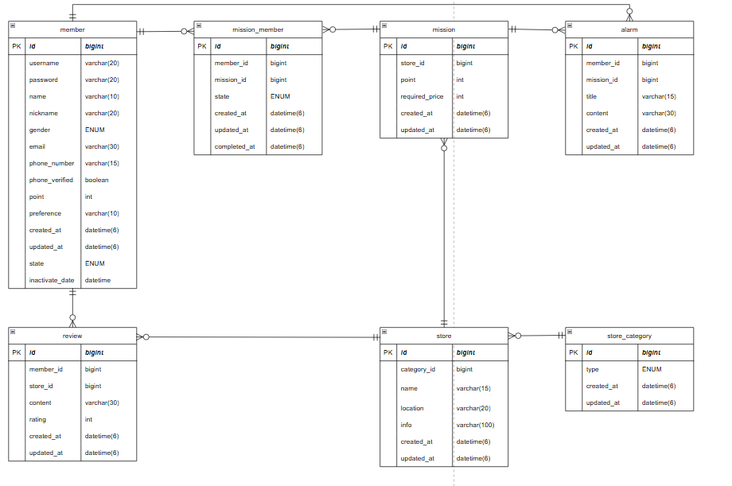
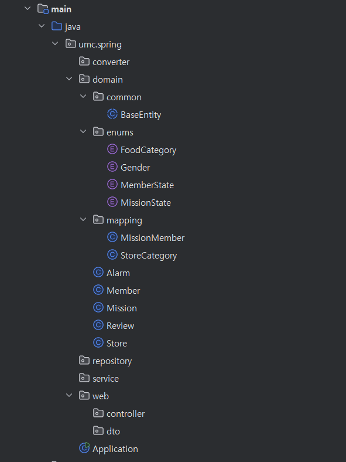
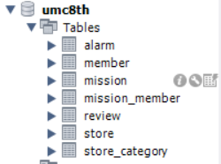

(ERD)

디렉토리는 다음과 같이 설정했다.



각각의 도메인의 중요 사항들과 코드는 다음과 같다.

1. member
    - gender: ENUM 타입

    ```java
    public enum Gender {
    	MALE, FEMALE
    }
    ```

    - state: ENUM 타입(mission의 state와 구분하기 위해 MemberState로 설정)

    ```java
    public enum MemberState {
    	ENABLED, DISABLING, DISABLED
    }
    ```

    - alarm과 1:N 관계(1)

    ```java
    @OneToMany(mappedBy = "member", cascade = CascadeType.ALL)
    private List<Alarm> alarmList = new ArrayList<>();
    ```

    - mission_member와 1:N 관계(1)

    ```java
    @OneToMany(mappedBy = "member", cascade = CascadeType.ALL)
    private List<MissionMember> missionMemberList = new ArrayList<>();
    ```

    - review와 1:N 관계(1) (리뷰 작성자가 탈퇴하더라도 리뷰는 유지되도록 cascade 설정 x)

    ```java
    @OneToMany(mappedBy = "member")
    private List<Review> reviewList = new ArrayList<>();
    ```

2. mission_member
    - state: ENUM 타입(member의 state와 구분하기 위해 MissionState로 설정)

    ```java
    public enum MissionState {
        READY, ACTIVE, COMPLETED
    }
    ```

    - member와 1:N 관계(N)

    ```java
    @ManyToOne(fetch = FetchType.LAZY)
    @JoinColumn(name = "member_id")
    private Member member;
    ```

    - mission과 1:N 관계(N)

    ```java
    @ManyToOne(fetch = FetchType.LAZY)
    @JoinColumn(name = "mission_id")
    private Mission mission;
    ```

3. mission
    - mission_member와 1:N 관계(1)

    ```java
    @OneToMany(mappedBy = "mission", cascade = CascadeType.ALL)
    private List<MissionMember> missionMemberList = new ArrayList<>();
    ```

    - store과 1:N 관계(N)

    ```java
    @ManyToOne(fetch = FetchType.LAZY)
    @JoinColumn(name = "store_id")
    private Store store;
    ```

    - alarm과 1:N 관계(1)

    ```java
    @OneToMany(mappedBy = "mission", cascade = CascadeType.ALL)
    private List<Alarm> alarmList = new ArrayList<>();
    ```

4. review
    - member와 1:N 관계(N)

    ```java
    @ManyToOne(fetch = FetchType.LAZY)
    @JoinColumn(name = "member_id")
    private Member member;
    ```

    - store와 1:N 관계(N)

    ```java
    @ManyToOne(fetch = FetchType.LAZY)
    @JoinColumn(name = "store_id")
    private Store store;
    ```

5. store
    - review와 1:N 관계(1)

    ```java
    @OneToMany(mappedBy = "store")
    private List<Review> reviewList = new ArrayList<>();
    ```

    - mission과 1:N 관계(1)

    ```java
    @OneToMany(mappedBy = "store")
    private List<Mission> missionList = new ArrayList<>();
    ```

    - store_category와 1:N 관계(N)

    ```java
    @ManyToOne(fetch = FetchType.LAZY)
    @JoinColumn(name = "category_id")
    private StoreCategory category;
    ```

6. store_category
    - category: ENUM 타입

    ```java
    public enum FoodCategory {
        KOREAN, CHINESE, JAPANESE, WESTERN, CAFE // 등등
    }
    ```

    - store와 1:N 관계(1) ( 카테고리가 사라져도 store가 사라지지 않도록 cascade 설정 x)

    ```java
    @OneToMany(mappedBy = "category")
    private List<Store> storeList = new ArrayList<>();
    ```


이외에 필요한 컬럼들을 추가해줬다.

- Member

    ```java
    @Entity
    @Getter
    @Builder
    @NoArgsConstructor(access = AccessLevel.PROTECTED)
    @AllArgsConstructor
    public class Member extends BaseEntity {
    
        @Id
        @GeneratedValue(strategy = GenerationType.IDENTITY)
        private Long id;
    
        @Column(nullable = false, length = 20)
        private String username;
    
        @Column(nullable = false, length = 20)
        private String password;
    
        @Column(nullable = false, length = 10)
        private String name;
    
        @Column(nullable = false, length = 20)
        private String nickname;
    
        @Enumerated(EnumType.STRING)
        @Column(columnDefinition = "VARCHAR(10)")
        private Gender gender;
    
        @Column(nullable = false, length = 30)
        private String email;
    
        @Column(nullable = false, length = 15)
        private String phoneNumber;
    
        @Column(nullable = false, columnDefinition = "BOOLEAN DEFAULT false")
        private boolean phoneVerified = false;
    
        private int point;
    
        private String preference;
    
        @Enumerated(EnumType.STRING)
        @Column(columnDefinition = "VARCHAR(15) DEFAULT 'ENABLED'")
        private MemberState state;
    
        private LocalDate inactivateDate;
    
        @OneToMany(mappedBy = "member", cascade = CascadeType.ALL)
        private List<MissionMember> missionMemberList = new ArrayList<>();
    
        @OneToMany(mappedBy = "member")
        private List<Review> reviewList = new ArrayList<>();
    
        @OneToMany(mappedBy = "member", cascade = CascadeType.ALL)
        private List<Alarm> alarmList = new ArrayList<>();
    }
    ```

- Mission

    ```java
    @Entity
    @Getter
    @Builder
    @NoArgsConstructor(access = AccessLevel.PROTECTED)
    @AllArgsConstructor
    public class Mission extends BaseEntity {
    
        @Id
        @GeneratedValue(strategy = GenerationType.IDENTITY)
        private Long id;
    
        @Column(nullable = false)
        private int point;
    
        @Column(nullable = false)
        private int required_price;
    
        @ManyToOne(fetch = FetchType.LAZY)
        @JoinColumn(name = "store_id")
        private Store store;
    
        @OneToMany(mappedBy = "mission", cascade = CascadeType.ALL)
        private List<MissionMember> missionMemberList = new ArrayList<>();
    
        @OneToMany(mappedBy = "mission", cascade = CascadeType.ALL)
        private List<Alarm> alarmList = new ArrayList<>();
    }
    ```

- Review

    ```java
    @Entity
    @Getter
    @Builder
    @NoArgsConstructor(access = AccessLevel.PROTECTED)
    @AllArgsConstructor
    public class Review extends BaseEntity {
    
        @Id
        @GeneratedValue(strategy = GenerationType.IDENTITY)
        private Long id;
    
        @Column(length = 30)
        private String content;
    
        @Column(nullable = false)
        private int rating;
    
        @ManyToOne(fetch = FetchType.LAZY)
        @JoinColumn(name = "member_id")
        private Member member;
    
        @ManyToOne(fetch = FetchType.LAZY)
        @JoinColumn(name = "store_id")
        private Store store;
    }
    ```

- Store

    ```java
    @Entity
    @Getter
    @Builder
    @NoArgsConstructor(access = AccessLevel.PROTECTED)
    @AllArgsConstructor
    public class Store extends BaseEntity {
    
        @Id
        @GeneratedValue(strategy = GenerationType.IDENTITY)
        private Long id;
    
        @Column(nullable = false, length = 15)
        private String name;
    
        @Column(nullable = false, length = 20)
        private String location;
    
        @Column(length = 100)
        private String info;
    
        @OneToMany(mappedBy = "store")
        private List<Mission> missionList = new ArrayList<>();
    
        @OneToMany(mappedBy = "store")
        private List<Review> reviewList = new ArrayList<>();
    
        @ManyToOne(fetch = FetchType.LAZY)
        @JoinColumn(name = "category_id")
        private StoreCategory category;
    }
    ```

- Alarm

    ```java
    @Entity
    @Getter
    @Builder
    @NoArgsConstructor(access = AccessLevel.PROTECTED)
    @AllArgsConstructor
    public class Alarm extends BaseEntity {
    
        @Id
        @GeneratedValue(strategy = GenerationType.IDENTITY)
        private Long id;
    
        @Column(nullable = false, length = 15)
        private String title;
    
        @Column(nullable = false, length = 30)
        private String content;
    
        @ManyToOne(fetch = FetchType.LAZY)
        @JoinColumn(name = "member_id")
        private Member member;
    
        @ManyToOne(fetch = FetchType.LAZY)
        @JoinColumn(name = "mission_id")
        private Mission mission;
    }
    ```

- MissionMember

    ```java
    @Entity
    @Getter
    @Builder
    @NoArgsConstructor(access = AccessLevel.PROTECTED)
    @AllArgsConstructor
    public class MissionMember extends BaseEntity {
    
        @Id
        @GeneratedValue(strategy = GenerationType.IDENTITY)
        private Long id;
    
        @Enumerated(EnumType.STRING)
        private MissionState state;
    
        @ManyToOne(fetch = FetchType.LAZY)
        @JoinColumn(name = "member_id")
        private Member member;
    
        @ManyToOne(fetch = FetchType.LAZY)
        @JoinColumn(name = "mission_id")
        private Mission mission;
    
        private LocalDate completedAt;
    }
    ```

- StoreCategory

    ```java
    @Entity
    @Getter
    @Builder
    @NoArgsConstructor(access = AccessLevel.PROTECTED)
    @AllArgsConstructor
    public class StoreCategory extends BaseEntity {
    
        @Id
        @GeneratedValue(strategy = GenerationType.IDENTITY)
        private Long id;
    
        @Enumerated(EnumType.STRING)
        private StoreCategory type;
    
        @OneToMany(mappedBy = "category")
        private List<Store> storeList = new ArrayList<>();
    }
    ```


다음과 같이 테이블이 생성됐다.



> **github 링크**
>
> https://github.com/kjhyeon0620/umc8th/tree/mission5