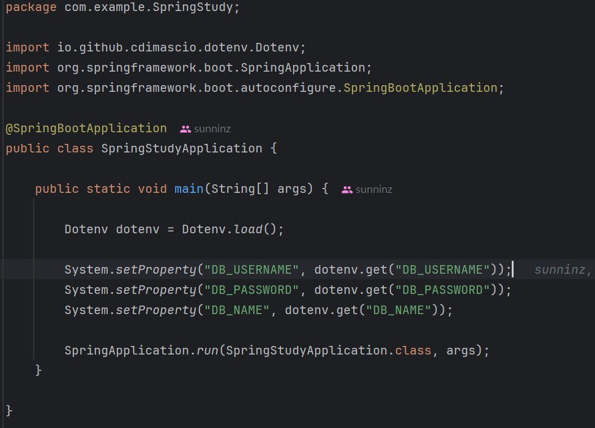
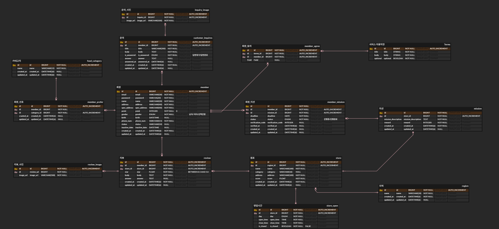

# 미션

## 1. DB연결
- 환경변수(.env)로 처리

```
DB_USERNAME=username
DB_PASSWORD=passward
DB_NAME=dbname
```
- application.yml


- SpringStudyApplication




## 2. ERD 기반으로 엔티티 구성


- 리뷰, 문의 이미지와 영업시간 테이블 제외

### 2-1. Entity 생성
- Member, Review, Inquiry, FoodCategory, Store, Region, Mission, Terms 엔티티 생성

### 2-2. Mapping Entity 생성
- MemberPrefer, MemberMission, MemberAgree 엔티티 생성

### 2-3. Base Entity 생성
- created_at, updated_at
- 모든 테이블에서  Base 엔티티 상속받도록 변경

## 3. 연관 관계 매핑
### 3-1. 단반향 매핑
- 1:N에서 N에 해당하는 객체에 연관관계 설정
    
### 3-2. 양방향 매핑
- 1:N에서 1에 해당하는 객체에 연관관계 설정

## 4. 세부 설정 작성
- 예시) member, member_mission 테이블


## 결과


## 깃허브
[5주차 미션 깃허브 링크](https://github.com/sunninz/UMC-Spring-Study/tree/mission5)

---
# 시니어 미션
## 미션1
[성능을 고려한 JPA 연관관계 매핑 전략](https://velog.io/@sunnin/UMC-성능을-고려한-JPA-연관관계-매핑-전략)
## 미션2
[JPA의 트랜잭션 처리와 동시성 제어로 안정적인 서비스 만들기](https://velog.io/@sunnin/UMC-JPA의-트랜잭션-처리와-동시성-제어로-안정적인-서비스-만들기)