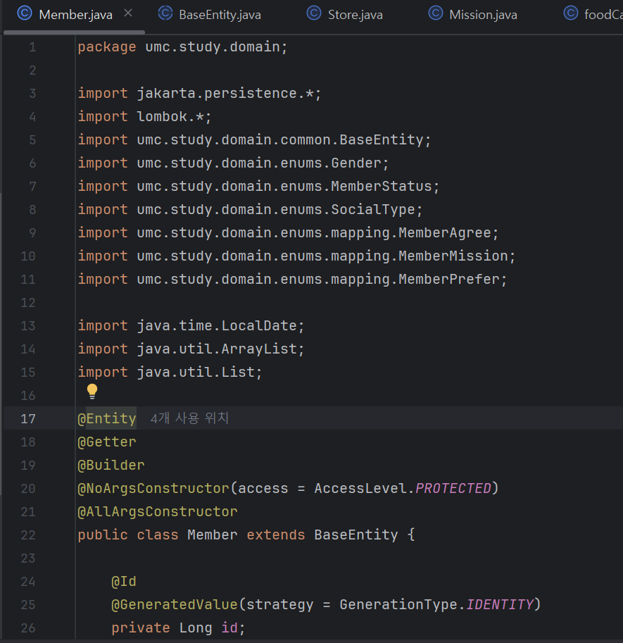

- **미션 기록**
1. 엔터티들 생성

2. 양방향 관계 맵핑
   - MemberPrefer
   

   - MemberMission
   

   - MemberAgree
   

   - Review
   

3. 실제 study 데이터베이스에 추가된 모습
 

> **github 링크**
>
>
> https://github.com/heexji/umc_spring/tree/mission5
>