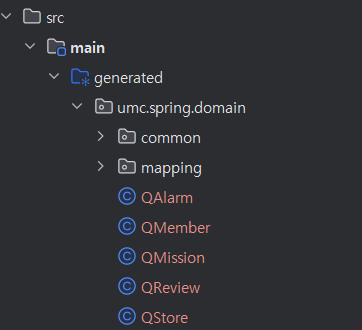
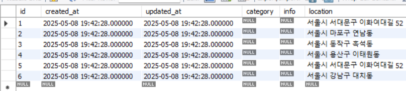
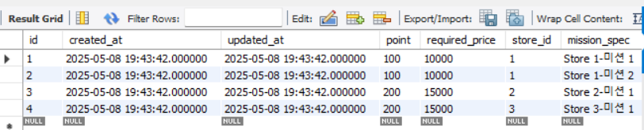
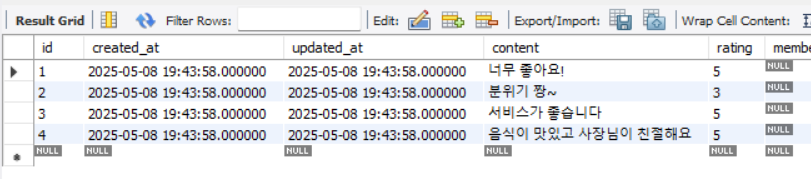
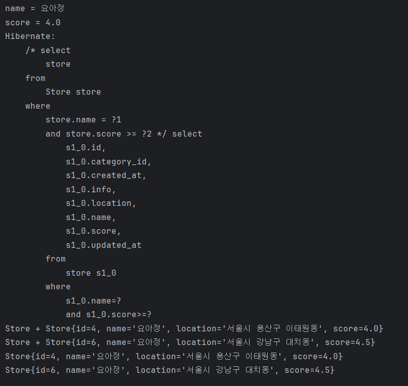

# ☑️ 실습 인증



`build.gradle` 에 의존성을 추가한 후 위와 같이 Q 클래스가 생성되었다.

이후에 워크북의 내용에 따라 QueryDSL 설정 파일, storeRepository, storeService 파일들을 생성하고, 아래의 쿼리를 통해 더미 데이터를 생성했다.

    ```sql
    INSERT INTO store (id, name, location, score, created_at, updated_at)
    VALUES (1, 'Store 1', '서울시 서대문구 이화여대길 52', 4.5, NOW(), NOW()),
           (2, 'Store 2', '서울시 마포구 연남동', 3.8, NOW(), NOW()),
           (3, 'Store 3', '서울시 동작구 흑석동', 2.2, NOW(), NOW()),
           (4, '요아정', '서울시 용산구 이태원동', 4.0, NOW(), NOW()),
           (5, '요아정', '서울시 서대문구 이화여대길 52', 3.2, NOW(), NOW()),
           (6, '요아정', '서울시 강남구 대치동', 4.5, NOW(), NOW());
    
    INSERT INTO mission (id, mission_spec, point, required_price, store_id, created_at, updated_at)
    VALUES (1, 'Store 1-미션 1', 100, 10000, 1, NOW(), NOW()),
           (2, 'Store 1-미션 2', 100, 10000, 1, NOW(), NOW()),
           (3, 'Store 2-미션 1', 200, 15000, 2, NOW(), NOW()),
           (4, 'Store 3-미션 1', 200, 15000, 3, NOW(), NOW());
    
    INSERT INTO review (id, content, rating, store_id, created_at, updated_at)
    VALUES (1, '너무 좋아요!', 5.0, 1, NOW(), NOW()),
           (2, '분위기 짱~', 3.0, 1, NOW(), NOW()),
           (3, '서비스가 좋습니다', 4.8, 2, NOW(), NOW()),
           (4, '음식이 맛있고 사장님이 친절해요', 4.5, 3, NOW(), NOW());  
    ```

Store



Mission



Review



각각 workbench에서 조회한 결과 더미 데이터가 잘 생성된 것을 확인할 수 있었다.

이후에 어플리케이션을 실행했을 때 아래 사진처럼 로그가 잘 출력되었다.

