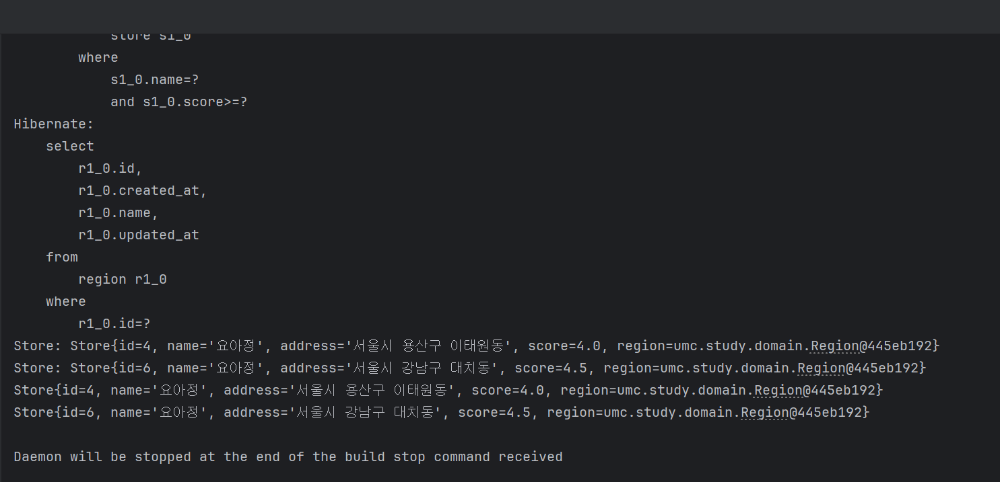

## 실습
> github: https://github.com/heexji/umc_spring/tree/feature/week6
>

---
## 미션
### **1. 홈 화면**

선택한 지역의 가게에서 수행 가능한 미션 리스트를 페이징으로 조회

```java
public Page<Mission> getMissionsByRegion(String regionName, Pageable pageable) {
    QMission m = QMission.mission;
    QStore s = QStore.store;
    QRegion r = QRegion.region;

    List<Mission> content = queryFactory
        .selectFrom(m)
        .join(m.store, s).fetchJoin()
        .join(s.region, r)
        .where(r.name.eq(regionName))
        .offset(pageable.getOffset())
        .limit(pageable.getPageSize())
        .fetch();

    Long count = queryFactory
        .select(m.count())
        .from(m)
        .join(m.store, s)
        .join(s.region, r)
        .where(r.name.eq(regionName))
        .fetchOne();

    return new PageImpl<>(content, pageable, count != null ? count : 0);
}

```

---

### **2. 마이페이지**

특정 사용자가 작성한 리뷰를 모두 조회

```java

public List<Review> findReviewsByMember(Long memberId) {
    QReview r = QReview.review;
    QMember m = QMember.member;

    return queryFactory
        .selectFrom(r)
        .join(r.member, m)
        .where(m.id.eq(memberId))
        .fetch();
}

```

---

### **3. 내 미션 화면**

사용자 ID와 상태를 기준으로 진행 중/완료된 미션을 조회

```java

public List<MemberMission> findMissionsByStatus(Long memberId, MissionStatus status) {
    QMemberMission mm = QMemberMission.memberMission;

    return queryFactory
        .selectFrom(mm)
        .where(mm.member.id.eq(memberId)
            .and(mm.status.eq(status)))
        .fetch();
}

```

---

### 4. **리뷰 등록**

특정 가게에 리뷰를 작성하고 저장

```java
public Review saveReview(Review review) {
return reviewRepository.save(review);
}

```