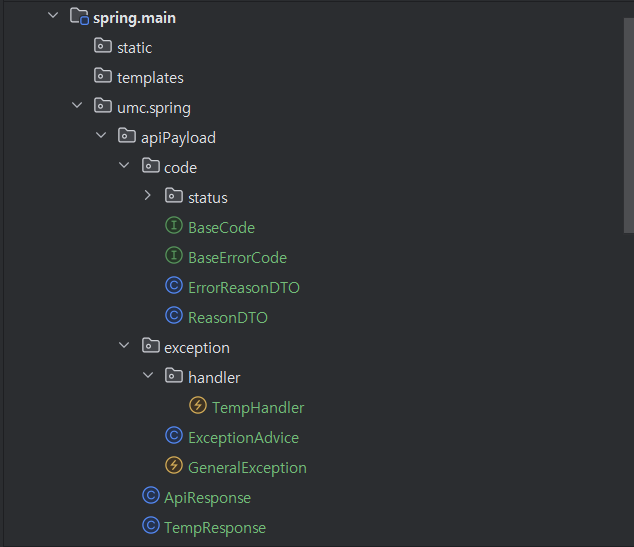
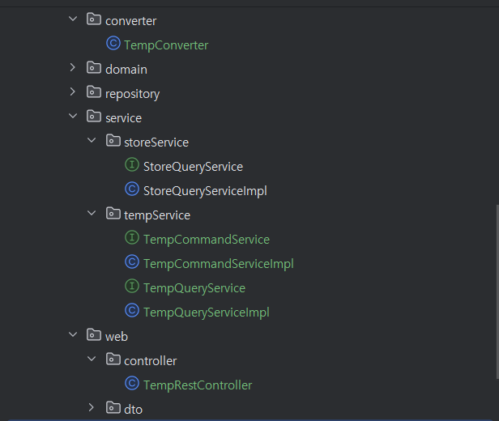
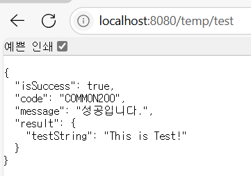
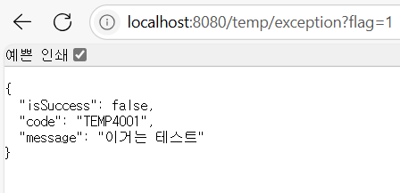

 #  실습 기록

  디렉토리는 다음과 같이 설정했다.

  

  

  /temt/test 경로로 GET 요청했을 때, 다음과 같은 응답이 나타난다.

  

  /temp/exception 경로로 GET 요청했을 때, flag에 따라 다음과 같은 응답이 나타난다.

  

  


# RestControllerAdvice
    
## 장점 및 미사용 시 불편한 점
        
### ✅장점
        
1. 중앙 집중식 예외 처리
    - 모든 컨트롤러의 예외를 단일 클래스에서 관리
                
        → 코드 중복 제거 및 유지보수성 향상
                
    - 일관된 에러 응답 구조
                
        → 클라이언트가 예측 가능한 형식으로 에러 수신
                
2. REST API 최적화
    - `@ResponseBody`가 내장되어 에러 응답을 자동으로 JSON/XML로 변환
                
        → 별도의 View Resolver 설정 필요 X
                
    - HTTP 상태 코드와 커스텀 코드 분리
                
        예: `400 BAD_REQUEST` + `"code": "MEMBER4001"`
                
3. 확장성과 유연성
    - 예외 유형별 세분화된 처리
                
        → `@ExceptionHandler` 로 특정 예외에 대한 로직 분리
                
    - 도메인별 커스텀 예외 추가 용이
                
        예: `GeneralException`, `ValidationException` 
                
4. 협업 효율성
    - 프론트엔드와의 약속된 에러 규약 유지
                
        → 에러 코드, 메시지, 포맷 통일
                
    - 디버깅 정보 통합
                
        → 로깅, 스택 트레이스 등을 응답에 포함 가능
                
        
### 😱 미사용 시 불편한 점
        
1. 코드 중복 및 유지보수 어려움
            
    ```java
    // 컨트롤러마다 try-catch 반복
    @RestController
    public class MemberController {
        @PostMapping
        public ResponseEntity<String> createMember() {
            try {
                // 비즈니스 로직
            } catch (ValidationException e) {
                return ResponseEntity.badRequest().body(e.getMessage()); // 매번 수동 처리
            }
        }
    }
            
    ```
            
    - 동일한 예외 처리 코드가 모든 컨트롤러에 반복됨
2. 응답 형식 불일치
    - 컨트롤러별로 다른 에러 포맷
                
        예: 일부는 `{ "error": "msg" }`, 다른 곳은 `{ “code”: 400 }`
                
3. 수동 응답 변환 필요
    - `ResponseBody` 누락 시 뷰 이름을 찾아 404 에러 발생
                
        예: `return "errorPage";` → 클라이언트가 HTML 수신
                
4. 예외 처리 누락 위험
    - 특정 컨트롤러에서 예외 핸들러를 빼먹을 경우
                
        → 클라이언트에 raw 스택 트레이스 노출
                
        
### 👉 사용 vs 미사용 비교
        
| **구분** | **@RestControllerAdvice 사용** | **미사용** |
    | --- | --- | --- |
    | **코드 중복** | 전역 처리로 중복 없음 | 컨트롤러마다 try-catch 반복 |
    | **응답 형식** | 일관된 JSON/XML 응답 자동 생성 | 개발자별로 다른 형식 사용 가능성 높음 |
    | **유지보수** | 예외 처리 로직 수정이 한 곳에서 가능 | 모든 컨트롤러를 수정해야 함 |
    | **에러 노출 위험** | 처리되지 않은 예외 자동 캐치 | 미처리 예외로 인한 보안 취약점 발생 가능 |
    | **REST 최적화** | **`@ResponseBody`** 내장으로 별도 설정 불필요 | 각 메서드에 **`@ResponseBody`** 추가 필요 |
    
# 미션 목록 조회(진행중, 진행완료) API 명세서
    
| API Endpoint | GET /missions?state=STATE |
    | --- | --- |
    | Request Body | X |
    | Request Header | Authorization: Bearer {accessToken} |
    | Query String | ?state=STATE(진행중/진행완료) |
    | Path Variable | X |


> **github 링크**
>
>
> https://github.com/kjhyeon0620/umc8th/tree/week7
>