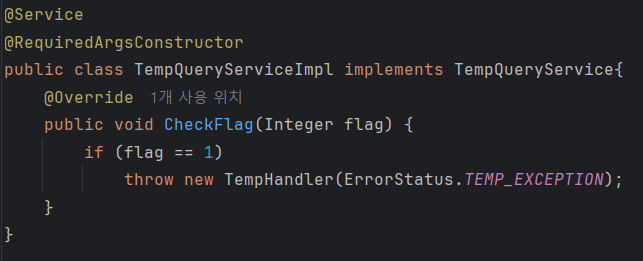

### API 동작 확인

**BaseCode & SuccessStatus**


- BaseCode 인터페이스 구현

**요청과 응답 사이에서 데이터를 전달하는 DTO**


**응답 DTO를 변환하는 Converter**


**API Controller**


**결과**


- API 응답 성공

### error handling

**BaseErrorCode 인터페이스**


- ErrorReasonDTO의 메소드의 인터페이스

**ErrorStatus enum 타입**


- 에러 응답 정리


- BaseErrorCode의 인터페이스를 ErrorStatus에서 구현

**GeneralException**


- JAVA에서 제공하는 RuntimeException을 상속받음

**ExceptionAdvice**


- @RestControllerAdvice(annottion=RestController.class)를 통해 RestController의 요청, 응답, 예외 처리를 대신하는 부분

### Exception Handling

ErrorStatus에 예외 처리 응답 메시지 추가

**TempHandler로 예외 처리 핸들러 추가**


- GeneralException을 상속받아서 구현

**TempResponse DTO - 여기서는 예외처리 DTO  추가**


**예외처리 DTO의 Converter**


**예외 처리 Controller 추가**


**TempQueryService: 예외 발생 시키서 검증하기**



> flag 값에 따라 예외를 발생시키기 위해서
>
>
> → 예를 들어, `flag == 1`이면 `GeneralException` 같은 걸 던지게 만들 수도 있음
>

**즉, "flag 값에 따라 예외가 발생하는지 테스트하거나, 유효한 값인지 검증하는 로직"을 따로 `Service`로 분리한 거야.**

**결과**


- 성공!!!

## RestControllerAdvice

### **@RestControllerAdvice란?**

`@RestControllerAdvice`는 Spring Framework에서 **REST API 전용 전역 예외 처리 클래스**를 만들 때 사용하는 어노테이션

**정의**

> @RestControllerAdvice = @ControllerAdvice + @ResponseBody
>
- `@ControllerAdvice`: 전역 예외 처리 클래스
- `@ResponseBody`: return 값을 JSON 또는 XML로 변환

---

**역할**

1. **전역 예외 처리**
    - 컨트롤러에서 발생한 예외를 한 곳에서 처리
2. **일관된 응답 포맷 유지**
    - API 응답을 공통 형식(`ApiResponse`, `ErrorDTO` 등)으로 반환
3. **코드 중복 제거**
    - 모든 컨트롤러에서 예외 처리 반복 안 해도 됨

---

### 장점

1. **전역 예외 처리**
- 컨트롤러마다 예외 처리 코드를 반복하지 않고 한 곳에서 관리 가능
- 코드 중복 제거 → 깔끔하고 간결한 컨트롤러 유지

---

2. **응답 형식의 일관성 유지**

- 에러 발생 시에도 `ApiResponse`, `ErrorDTO` 등으로 항상 **일관된 JSON 구조** 제공 가능

  → 프론트엔드에서 처리 로직 단순화


---

3. **컨트롤러 코드와 예외 로직 분리 (관심사 분리, SoC)**

- 컨트롤러는 요청/응답에만 집중
- 예외 처리 로직은 Advice에서 전담 → 유지보수 편리

---

4. **유연한 적용 범위 설정**

- 특정 패키지, 어노테이션, 타입만 처리하도록 범위 제한 가능

  예: `@RestControllerAdvice(basePackages = "com.example.api")`


---

5. **스프링이 기본 제공하는 예외도 오버라이드 가능**

- `ResponseEntityExceptionHandler`를 상속하면

  `handleMethodArgumentNotValid` 등 기본 예외 처리도 커스터마이징 가능


---

6. **로깅, 에러 추적, AOP 활용에 유리**

- 에러 로깅, 슬랙/디스코드 알림, 추적 코드 삽입 등

  부가 기능을 한 곳에서 관리 가능


### **Advice란?**

RestControllerAdvice도 Advice의 한 종류이다.

> “ **언제, 어떤 부가적인 로직을** 핵심 로직 외부에서 끼워 넣을지 정의한 코드 조각"
>

즉, **핵심 비즈니스 로직을 건드리지 않고도**, **로깅, 예외 처리, 트랜잭션, 보안** 같은 부가기능을 외부에서 "끼워넣는" 방식이다.

## 미션 목록 조회(진행중, 진행 완료) API 명세서

### 1. 진행 중인 미션 목록 조회 API

**[GET] /mission**

| **항목** | **내용** |
| --- | --- |
| 설명 | 회원이 진행 중인 미션 목록 전체를 조회하는 API |
| Method | GET |
| URL | /mission?member_id=1&state=ACTIVE |

**요청 파라미터**

| **이름** | **타입** | **필수** | **설명** |
| --- | --- | --- | --- |
| member_id | bigint | O | 회원의 ID |
| state | ENUM | O | 미션의 상태(READY, ACTIVE, COMPLETED) |

**응답 형식 (응답 성공: 200)**

```json
{
  "isSuccess": true,
  "code": "200",
  "message": "미션 진행 중 목록 조회 성공",
  "result": [
    {
      "missionId": 1,
      "title": "광운대 돈가스 맛집 탐방",
      "point": 1000,
      "state": "ACTIVE",
      "joinedAt": "2025-05-01T12:00:00"
    },
    {
      "missionId": 1,
      "title": "광운대 덮밥 맛집 탐방",
      "point": 1000,
      "state": "ACTIVE",
      "joinedAt": "2025-05-01T13:00:00"
    },
    {
      "missionId": 1,
      "title": "광운대 맛집 이층집 부대찌개 먹기",
      "point": 2500,
      "state": "ACTIVE",
      "joinedAt": "2025-05-01T14:00:00"
    }
  ]
}
```

**에러 응답**

| **HTTP 상태** | **코드** | **메시지** | **설명** |
| --- | --- | --- | --- |
| 400 | MEMBER4000 | 회원 정보가 없습니다. | 존재하지 않는 회원 |
| 400 | STATE4000 | 진행 중인 미션이 없습니다. | 진행 중인 미션이 존재하지 않음 |
| 500 | SERVER5000 | 서버 에러 | 서버 시스템 에러 |

### 2. 진행 완료 미션 목록 조회 API

**[GET] /mission**

| **항목** | **내용** |
| --- | --- |
| 설명 | 회원이 완료한 미션 목록 전체를 조회하는 API |
| Method | GET |
| URL | /mission?member_id=1&state=COMPLETE |

**요청 파라미터**

| **이름** | **타입** | **필수** | **설명** |
| --- | --- | --- | --- |
| member_id | bigint | O | 회원의 ID |
| state | ENUM | O | 미션의 상태(READY, ACTIVE, COMPLETED) |

**응답 형식 (응답 성공: 200)**

```json
{
  "isSuccess": true,
  "code": "200",
  "message": "미션 완료한 목록 조회 성공",
  "result": [
    {
      "missionId": 1,
      "title": "광운대 돈가스 맛집 탐방",
      "point": 1000,
      "state": "COMPLETE",
      "joinedAt": "2025-05-01T12:00:00"
    },
    {
      "missionId": 1,
      "title": "광운대 덮밥 맛집 탐방",
      "point": 1000,
      "state": "COMPLETE",
      "joinedAt": "2025-05-01T13:00:00"
    },
    {
      "missionId": 1,
      "title": "광운대 맛집 이층집 부대찌개 먹기",
      "point": 2500,
      "state": "COMPLETE",
      "joinedAt": "2025-05-01T14:00:00"
    }
  ]
}
```

**에러 응답**

| **HTTP 상태** | **코드** | **메시지** | **설명** |
| --- | --- | --- | --- |
| 400 | MEMBER4000 | 회원 정보가 없습니다. | 존재하지 않는 회원 |
| 400 | STATE4000 | 완료한 미션이 없습니다. | 완료한 미션이 존재하지 않음 |
| 500 | SERVER5000 | 서버 에러 | 서버 시스템 에러 |

