## 🔥 1. 특정 지역에 가게 추가하기 API

| API Endpoint | POST /stores                                                                                                  |
| --- |---------------------------------------------------------------------------------------------------------------|
| Request Body | {<br>”name”: “광운대 카페“,<br> ”location”: “서울시 노원구”,<br> ”info”: “아늑한 분위기의 카페”,<br> ”storeCategory”: [1, 2]<br>} |
| Request Header | Authorization: Bearer {accessToken}                                                                           |
| Query String | .                                                                                                             |
| Path Variable | .                                                                                                             |

1. requestDTO, responseDTO 작성

    ```java
    public class StoreRequestDTO {
    
        @Getter
        public static class addWithLocationDto{
            @NotBlank
            String name;
            @NotNull
            String location;
            @NotNull
            String info;
            @ExistCategories
            List<Long> storeCategory;
        }
    }
    ```
   
    ```java
    public class StoreResponseDTO {
    
        @Builder
        @Getter
        @NoArgsConstructor
        @AllArgsConstructor
        public static class addWithLocationResultDTO{
            Long storeId;
            LocalDateTime createdAt;
        }
    }
    ```


2. Converter 작성
        
    ```java
    public class StoreConverter {
             //Store -> ResponseDTO
         public static StoreResponseDTO.addWithLocationResultDTO toAddWithLocationResultDTO(Store store) {
             return StoreResponseDTO.addWithLocationResultDTO.builder()
                 .storeId(store.getId())
                     .createdAt(LocalDateTime.now())
                     .build();
         }
             // RequestDTO -> Store
         public static Store toStore(StoreRequestDTO.addWithLocationDto request) {
             return Store.builder()
                     .name(request.getName())
                     .location(request.getLocation())
                     .info(request.getInfo())
                     .storeCategoryList(new ArrayList<>())
                     .build();
    
         }
     }
     ```
        
     ```java
     public class StoreCategoryConverter {
             // List<FoodCategory> -> List<StoreCategory> (Store/FoodCategory 매핑)
         public static List<StoreCategory> toStoreCategoryList(List<FoodCategory> foodCategoryList) {
             return foodCategoryList.stream()
                     .map(foodCategory -> StoreCategory.builder()
                                         .foodCategory(foodCategory)
                                         .build()
                     ).toList();
         }
     }
     ```

3. Controller 작성
        
    ```java
    @RestController
    @RequiredArgsConstructor
    @RequestMapping("/stores")
    public class StoreRestController {
    
      private final StoreCommandService storeCommandService;
    
      @PostMapping
      public ApiResponse<StoreResponseDTO.addWithLocationResultDTO> add(
              @RequestBody @Valid StoreRequestDTO.addWithLocationDto request) {
          Store store = storeCommandService.addStoreWithLocation(request);
          return ApiResponse.onSuccess(StoreConverter.toAddWithLocationResultDTO(store));
      }
    
    }
    ```
        
4. Service 작성
        
    ```java
    @Service
    @RequiredArgsConstructor
    @Transactional(readOnly = true)
    public class StoreCommandServiceImpl implements StoreCommandService {
    
        private final StoreRepository storeRepository;
        private final FoodCategoryRepository foodCategoryRepository;
    
        @Override
        @Transactional
        public Store addStoreWithLocation(StoreRequestDTO.addWithLocationDto request) {
            Store newStore = StoreConverter.toStore(request);
            // 본문의 MemberPrefer, FoodCategory 매핑과 동일한 방식 
            List<FoodCategory> foodCategoryList = request.getStoreCategory().stream()
                    .map(category -> {
                        return foodCategoryRepository.findById(category).orElseThrow(
                                () -> new TempHandler(ErrorStatus.FOOD_CATEGORY_NOT_FOUND));
                    }).toList();
            // Store과 StoreCategory 매핑
            List<StoreCategory> storeCategoryList = StoreCategoryConverter.toStoreCategoryList(foodCategoryList);
            storeCategoryList.forEach(storeCategory -> storeCategory.setStore(newStore));
    
            return storeRepository.save(newStore);
        }
    }
    ```
        
5. 결과
        
    > 가게 정보를 입력한 후 POST 요청을 전송하면 성공 응답이 반환된다.
    
    
    
    > 실제로 db에도 잘 저장되었다.
    
    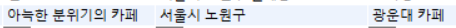
    
    > 존재하지 않는 음식 카테고리를 입력하면, FOOD_CATEGORY_NOT_FOUND 에러 코드가 반환된다.
    
    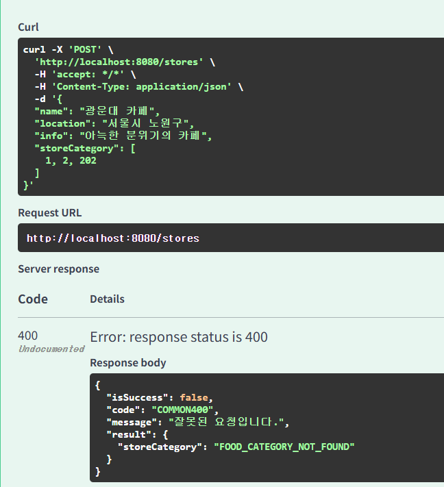
    
    > NotNull이나 NotBlank 조건에 위배되면, 에러 메시지가 반환된다.
    
    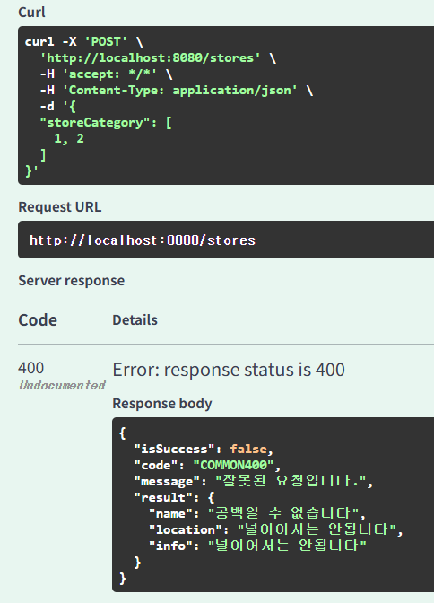


## 🔥 2. 가게에 리뷰 추가하기 API


| API Endpoint | POST /stores/{store_id}/reviews                |
| --- |------------------------------------------------|
| Request Body | {<br>”rating” : 2,<br>”content” : “별로예요”,<br>} |
| Request Header | Authorization: Bearer {accessToken}            |
| Query String | X                                              |
| Path Variable | {store_id}                                     |
1. requestDTO, responseDTO 작성
        
    ```java
    public class ReviewRequestDTO {
    
        @Getter
        public static class addDTO{
        
            @Min(1)
            @Max(5)
            int rating;
            String content;
        }
    }
    ```
        
    ```java
    public class ReviewResponseDTO {
    
        @Builder
        @Getter
        @NoArgsConstructor
        @AllArgsConstructor
        public static class addResultDTO{
            Long reviewId;
            LocalDateTime createdAt;
        }
    }
    ```
        
2. Converter 작성
        
    ```java
    public class ReviewConverter {
        // Review -> ResponseDTO
        public static ReviewResponseDTO.addResultDTO toAddResultDTO(Review review) {
            return ReviewResponseDTO.addResultDTO.builder()
                    .reviewId(review.getId())
                    .createdAt(LocalDateTime.now())
                    .build();
        }
        // RequestDTO -> Review
        public static Review toReview(ReviewRequestDTO.addDTO request) {
            return Review.builder()
                    .content(request.getContent())
                    .rating(request.getRating())
                    .build();
        }
    }
    ```
        
3. Controller 작성
        
    ```java
    @RestController
    @RequiredArgsConstructor
    @RequestMapping
    @Validated
    public class ReviewRestController {
    
        private final ReviewCommandService reviewCommandService;
    
        @PostMapping("/stores/{storeId}/reviews")
        public ApiResponse<ReviewResponseDTO.addResultDTO> add(
                @RequestBody @Valid ReviewRequestDTO.addDTO request,
                @ExistStore @PathVariable Long storeId) {
            // ExistStore를 통해 가게 존재 검증
   
            // memberId는 1로 하드 코딩
            Long memberIdWithToken = 1L;
            Review review = reviewCommandService.addReview(request, 1L, storeId);
            return ApiResponse.onSuccess(ReviewConverter.toAddResultDTO(review));
    
        }
    }
    ```
        
4. Service 작성
        
    ```java
    @Service
    @Transactional(readOnly = true)
    @RequiredArgsConstructor
    public class ReviewCommandServiceImpl implements ReviewCommandService{
    
        private final ReviewRepository reviewRepository;
        private final MemberRepository memberRepository;
        private final StoreRepository storeRepository;
    
        @Override
        @Transactional
        public Review addReview(ReviewRequestDTO.addDTO request, Long memberId, Long storeId) {
            Review newReview = ReviewConverter.toReview(request);
            // member와 store 조회 후, 연관관계 설정
            Member member = memberRepository.findById(memberId)
                    .orElseThrow(() -> new TempHandler(ErrorStatus.MEMBER_NOT_FOUND));
            Store store = storeRepository.findById(storeId)
                    .orElseThrow(() -> new TempHandler(ErrorStatus.STORE_NOT_FOUND));
            
            // 양방향 연관관계 설정은 setter에서 진행
            newReview.setMember(member);
            newReview.setStore(store);
    
            return reviewRepository.save(newReview);
        }
    }
    ```
        
5. 가게 검증을 위한 annotation 및 validator 정의
        
    ```java
    @Documented
    @Constraint(validatedBy = StoreExistValidator.class)
    @Target( {ElementType.METHOD, ElementType.FIELD, ElementType.PARAMETER, ElementType.TYPE_USE} )
    @Retention(RetentionPolicy.RUNTIME)
    public @interface ExistStore {
        String message() default "해당하는 가게가 존재하지 않습니다.";
        Class<?>[] groups() default {};
        Class<? extends Payload>[] payload() default {};
    }
    ```
        
    ```java
    @Component
    @RequiredArgsConstructor
    public class StoreExistValidator implements ConstraintValidator<ExistStore, Long> {
    
        private final StoreCommandService storeCommandService;
    
        @Override
        public void initialize(ExistStore constraintAnnotation) {
            ConstraintValidator.super.initialize(constraintAnnotation);
        }
    
        @Override
        public boolean isValid(Long storeId, ConstraintValidatorContext context) {
            // 서비스의 검증 메서드 사용
            boolean isValid = storeCommandService.isStoreExist(storeId);
    
            if (!isValid) {
                context.disableDefaultConstraintViolation();
                context.buildConstraintViolationWithTemplate(
                        ErrorStatus.STORE_NOT_FOUND.toString()).addConstraintViolation();
            }
            return isValid;
        }
    }
    ```
        
6. 결과
        
    > 리뷰 정보를 입력한 후, POST 요청을 전송하면 성공 응답이 반환된다.
    
    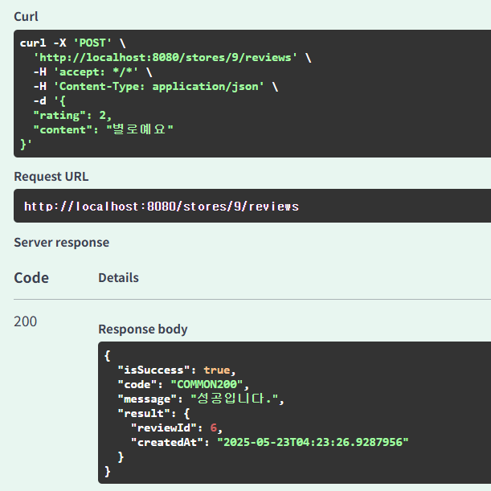
    
    > db에도 잘 저장되었다.
    
    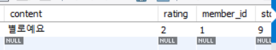
    
    > 존재하지 않는 가게 ID(999)를 입력했을 시에 STORE_NOT_FOUND가 반환된다.
    
    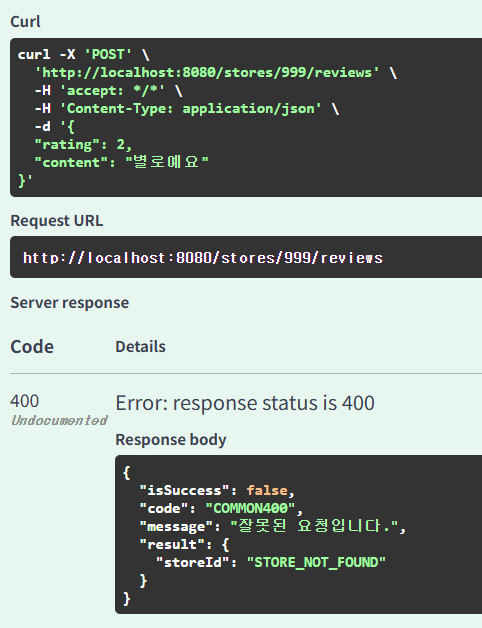
    
    > rating을 null로 전송하면 에러 메시지가 반환된다.
    
    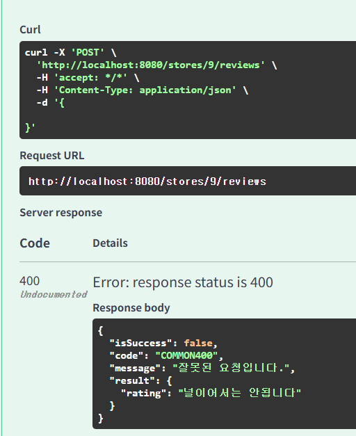


## 🔥 3. 가게에 미션 추가하기 API

| API Endpoint | POST /stores/{store_id}/missions                                                           |
| --- |--------------------------------------------------------------------------------------------|
| Request Body | {<br>”mission_spec”:  “store 9 - 미션 1”,<br>”point”: 1000,<br>”required_price”:  20000<br>} |
| Request Header | Authorization: Bearer {accessToken}                                                        |
| Query String | X                                                                                          |
| Path Variable | {store_id}                                                                                 |
1. requestDTO, responseDTO 작성

    ```java
    public class MissionRequestDTO {
    
      @Getter
      public static class addIntoStoreDTO{
    
          String missionSpec;
    
          @NotNull
          Integer point;
          @NotNull
          Integer requiredPrice;
      }
    }
    ```

    ```java
    public class MissionResponseDTO {
    
      @Getter
      @Builder
      @AllArgsConstructor
      @NoArgsConstructor
      public static class addIntoStoreResultDTO{
          Long missionId;
          LocalDateTime createdAt;
      }
    }
    ```

2. Converter 작성

    ```java
    public class MissionConverter {
        // Mission -> ResponseDTO
        public static MissionResponseDTO.addIntoStoreResultDTO toAddIntoStoreResultDTO(Mission mission) {
            return MissionResponseDTO.addIntoStoreResultDTO.builder()
                  .missionId(mission.getId())
                  .createdAt(LocalDateTime.now())
                  .build();
        }
        // RequestDTO -> Mission
        public static Mission toMission(MissionRequestDTO.addIntoStoreDTO request) {
            return Mission.builder()
                        .mission_spec(request.getMissionSpec())
                        .point(request.getPoint())
                        .requiredPrice(request.getRequiredPrice())
                        .build();
        }
    }
    ```

3. Controller 작성

    ```java
    @RestController
    @RequiredArgsConstructor
    @RequestMapping
    @Validated
    public class MissionRestController {
    
      private final MissionCommandService missionCommandService;
    
      @PostMapping("/stores/{storeId}/missions")
      public ApiResponse<MissionResponseDTO.addIntoStoreResultDTO> addMission(
              @RequestBody @Valid MissionRequestDTO.addIntoStoreDTO request,
              @ExistStore @PathVariable Long storeId) { 
          
          Mission mission = missionCommandService.addMissionIntoStore(request, storeId);
          return ApiResponse.onSuccess(MissionConverter.toAddIntoStoreResultDTO(mission));
    
      }
    }
    ```

4. Service 작성

    ```java
    @Service
    @Transactional(readOnly = true)
    @RequiredArgsConstructor
    public class MissionCommandServiceImpl implements MissionCommandService{
    
      private final MissionRepository missionRepository;
      private final StoreRepository storeRepository;
    
      @Override
      @Transactional
      public Mission addMissionIntoStore(MissionRequestDTO.addIntoStoreDTO request, Long storeId) {
          // Mission 생성 및 정보 입력
          Mission newMission = MissionConverter.toMission(request);
   
          // Store 조회 및 연관관계 설정
          Store store = storeRepository.findById(storeId)
                  .orElseThrow(() -> new TempHandler(ErrorStatus.STORE_NOT_FOUND));
          newMission.setStore(store);
          return missionRepository.save(newMission);
      }
    }
    ```
5. 결과

    > 미션 정보를 입력한 후, POST 요청을 전송하면 성공 응답이 반환된다.

    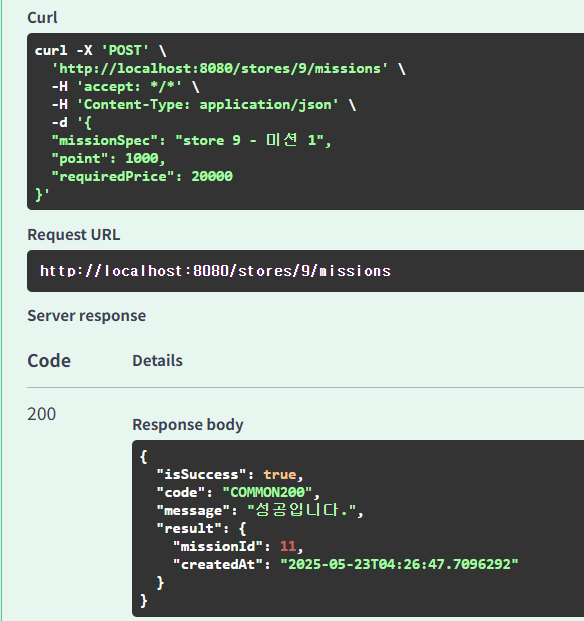
    
    > DB에도 정상적으로 저장되었다.

    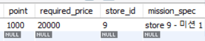
    
    > 존재하지 않는 가게 ID(999)를 입력하면, STORE_NOT_FOUND가 반환된다.
    
    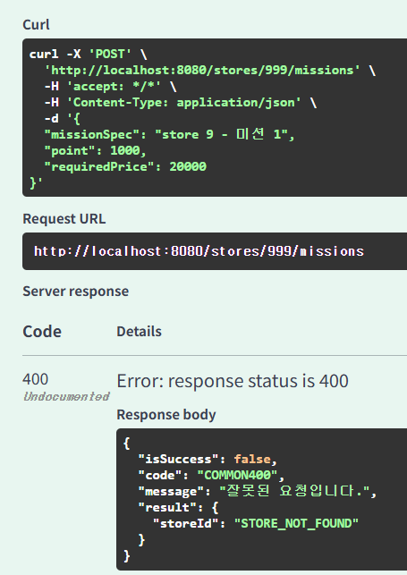
    
    > NotNull 조건에 위배되면, 에러 메시지가 반환된다.
    
    


## 🔥 4. 가게의 미션을 도전중인 미션에 추가(미션 도전하기) API

| API Endpoint | POST /missions/{mission_id}/challengers |
| --- | --- |
| Request Body |  |
| Request Header | Authorization: Bearer {accessToken} |
| Query String | X |
| Path Variable | {mission_id} |
1. responseDTO 작성

    ```java
    public class MissionMemberResponseDTO {
    
      @Getter
      @Builder
      @AllArgsConstructor
      @NoArgsConstructor
      public static class addChallengersResultDTO{
          Long missionMemberId;
          LocalDateTime createdAt;
      }
    }
    ```

2. Converter 작성

    ```java
    public class MissionMemberConverter {
      // MissionMember -> ResponseDTO
      public static MissionMemberResponseDTO.addChallengersResultDTO toAddChallengersResultDTO(
              MissionMember missionMember) {
          return MissionMemberResponseDTO.addChallengersResultDTO.builder()
                  .missionMemberId(missionMember.getId())
                  .createdAt(LocalDateTime.now())
                  .build();
      }
    }
    ```

3. Controller 작성

    ```java
    @PostMapping("/missions/{missionId}/challengers")
    public ApiResponse<MissionMemberResponseDTO.addChallengersResultDTO> addChallenger(
            @ChallengeableMission @PathVariable Long missionId) {
            // @ChallengeableMission 을 통해 이미 도전중인 미션인지 검증
   
        Long memberIdWithToken = 1L;
        MissionMember missionMember = missionCommandService.addChallenger(memberIdWithToken, missionId);
        return ApiResponse.onSuccess(MissionMemberConverter.toAddChallengersResultDTO(missionMember));
     }
    ```

4. Service 작성

    ```java
    @Transactional
    @Override
    public MissionMember addChallenger(Long memberId, Long missionId) {
        // member, mission 조회
        Member member = memberRepository.findById(memberId)
                .orElseThrow(() -> new TempHandler(ErrorStatus.MEMBER_NOT_FOUND));
        Mission mission = missionRepository.findById(missionId)
                .orElseThrow(() -> new TempHandler(ErrorStatus.MISSION_NOT_FOUND));
        
        // MissionMember 생성 및 정보 입력
        MissionMember newMissionMember = MissionMember.builder()
                .state(MissionState.CHALLENGING)
                .build();
    
        // member, mission과 양방향 연관관계 설정
        newMissionMember.setMember(member);
        newMissionMember.setMission(mission);
    
        return missionMemberRepository.save(newMissionMember);
    }
    ```

5. 도전 중인지 검증하기 위한 annotation 및 validator 작성

    ```java
    @Documented
    @Constraint(validatedBy = ChallengeableMissionValidator.class)
    @Target( {ElementType.METHOD, ElementType.FIELD, ElementType.PARAMETER} )
    @Retention(RetentionPolicy.RUNTIME)
    public @interface ChallengeableMission {
      String message() default "이미 도전중이거나, 완료한 미션입니다.";
      Class<?>[] groups() default {};
      Class<? extends Payload>[] payload() default {};
    }
    ```

    ```java
    @Component
    @RequiredArgsConstructor
    public class ChallengeableMissionValidator implements ConstraintValidator<ChallengeableMission, Long> {
    
      private final MissionMemberCommandService missionMemberCommandService;
    
      @Override
      public void initialize(ChallengeableMission constraintAnnotation) {
          ConstraintValidator.super.initialize(constraintAnnotation);
      }
    
      @Override
      public boolean isValid(Long missionId, ConstraintValidatorContext context) {
          // memberId는 1로 하드 코딩
          Long memberIdWithToken = 1L;
            
          // 서비스의 검증 메서드 사용
          boolean isValid = missionMemberCommandService.isMissionReadyForChallenge(memberIdWithToken, missionId);
    
          if (!isValid) {
              context.disableDefaultConstraintViolation();
              context.buildConstraintViolationWithTemplate(
                      ErrorStatus.ALREADY_CHALLENGED_MISSION.toString()).addConstraintViolation();
          }
          return isValid;
      }
    }
    ```

    MissionMember service에서 memberId와 missionId를 이용해 MissionMember를 조회한 후, READY 상태가 아니거나, 아직 생성되지 않았다면 도전 가능한 미션인 것으로 판단한다.

      ```java
          @Override
          public boolean isMissionReadyForChallenge(Long memberId, Long missionId) {
              return missionMemberRepository.findByMemberIdAndMissionId(memberId, missionId)
                      .map(missionMember -> missionMember.getState() == MissionState.READY)
                      .orElse(true);
          }
      ```

6. 결과

    > (requestBody 없음) 요청을 전송하면 성공 응답이 반환된다.
    
    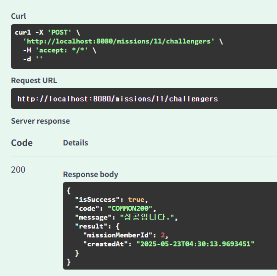
    
    > DB에도 정상적으로 저장되었다.

    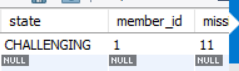
    
    > 같은 요청을 두 번 반복하면, ALREADY_CHALLENGED_MISSION이 반환된다.
     (이미 도전중인 미션을 도전하려고 시도함) 
    
    

## 🔥 5. Validator 수정
- repository에 접근하는 계층은 무조건 service 하나만 있어야 함.

    → service에 검증을 위한 메서드를 정의한 후, validator 에서는 service에만 접근한다.
    
- ex) @ExistCategories 검증
    
    CategoriesExistValidator 에서는 foodCategory service에만 접근하고,

    ```java
    private final FoodCategoryCommandService foodCategoryService;
    .
    .
    .
    boolean isValid = foodCategoryService.areCategoriesValid(values);
    ```

    foodCategory service에서 foodCategory repository에 접근하여 검증을 진행한다.

    ```java
      private final FoodCategoryRepository foodCategoryRepository;
      
      public boolean areCategoriesValid(List<Long> categoryIdList) {
          return categoryIdList.stream().allMatch(foodCategoryRepository::existsById);
      }
    ```