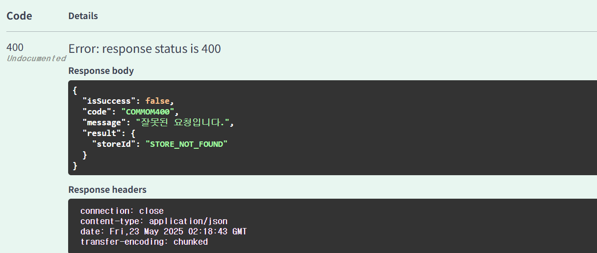
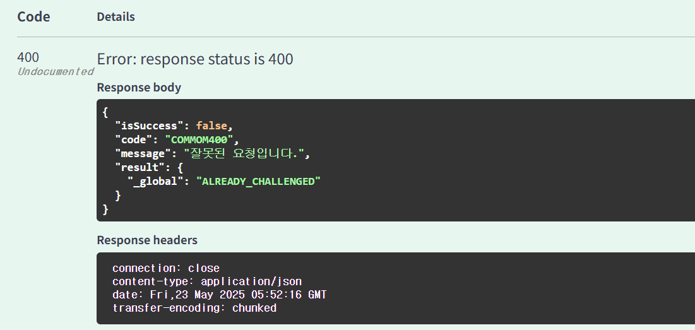
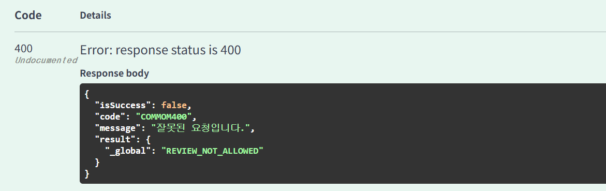

# 미션

## 미션추가하기

- DTO
```java
public class MissionRequestDTO {
    @Getter
    public static class CreateMissionDTO {
        @NotNull
        private LocalDate deadline;
        @NotNull
        private String missionDescription;

        @Min(value = 500)
        @Max(value = 2000)
        private Integer reward;
        @NotNull
        @ExistStore //커스텀 어노테이션
        private Long storeId;
    }
}
```

- converter
```java
public class MissionConverter {
    public static MissionResponseDTO.CreateResultDTO toCreateResultDTO(Mission mission){
        return MissionResponseDTO.CreateResultDTO.builder()
                .missionId(mission.getId())
                .createdAt(LocalDateTime.now())
                .build();

    }

    public static Mission toMission(MissionRequestDTO.CreateMissionDTO request, Store store){
        return Mission.builder()
                .missionDescription(request.getMissionDescription())
                .deadline(request.getDeadline())
                .reward(request.getReward())
                .store(store)
                .build();

    }
}
```

- controller
```java
    @PostMapping("/")
    public ApiResponse<MissionResponseDTO.CreateResultDTO> createMission(@RequestBody @Valid MissionRequestDTO.CreateMissionDTO request){
        Mission mission = missionCommandService.createMission(request);

        return ApiResponse.onSuccess(MissionConverter.toCreateResultDTO(mission));
    }
```
- service
```java
    @Transactional
    @Override
    public Mission createMission(MissionRequestDTO.CreateMissionDTO request) {

        Store store = storeRepository.findById(request.getStoreId())
                .orElseThrow();

        Mission mission = missionConverter.toMission(request, store);
        return missionRepository.save(mission);
    }

    @Override
    public boolean storeExist(Long id) {
        return storeRepository.existsById(id);
    }
```

- validator

이미 존재하는 가게의 미션이라면 추가 불가능
```java
public class StoreExistValidator implements ConstraintValidator<ExistStore, Long> {

    private final MissionCommandService missionCommandService;
    @Override
    public void initialize(ExistStore constraintAnnotation) {
        ConstraintValidator.super.initialize(constraintAnnotation);
    }

    @Override
    public boolean isValid(Long value, ConstraintValidatorContext context) {

        boolean isValid = missionCommandService.storeExist(value);

        if (!isValid){
            context.disableDefaultConstraintViolation();
            context.buildConstraintViolationWithTemplate(ErrorStatus.STORE_NOT_FOUND.toString()).addConstraintViolation();
        }

        return isValid;
    }


}
```

- 결과




##  미션도전하기
- dto
  - `@ExistMission`: mission이 존재하는지 확인하기 위한 어노테이션
  - `@ExistMember`: member가 존재하는지 확인하기 위한 어노테이션
  - `@NoDuplicateChallenge` : 이미 진행중이거나 완료된 미션을 진행할 수 없도록 검증하는 어노테이션
```java
public class MemberMissionRequestDTO {

    @Getter
    @NoDuplicateChallenge  //커스텀 어노테이션
    public static class ChallengeDTO {
        @NotNull
        @ExistMember  //커스텀 어노테이션
        private Long memberId;

        @NotNull
        @ExistrMission  //커스텀 어노테이션
        private Long missionId;
    }
}
```
 - converter
```java

    public static MemberMissionResponseDTO.CreateChallengeResultDTO toCreateChallengeResultDTO(MemberMission memberMission){
        return MemberMissionResponseDTO.CreateChallengeResultDTO.builder()
                .memberMissionId(memberMission.getId())
                .createdAt(LocalDateTime.now())
                .build();
    }

    public static MemberMission toMemberMission(Member member, Mission mission){
        return MemberMission.builder()
                .member(member)
                .mission(mission)
                .status(MissionStatus.CHALLENGING)
                .build();
    }
```
- controller
```java
    @PostMapping("/challenge")
    public ApiResponse<MemberMissionResponseDTO.CreateChallengeResultDTO> createChallange(@RequestBody @Valid MemberMissionRequestDTO.ChallengeDTO request){

        MemberMission result= memberMissionCommandService.createChallenge(request);
        return ApiResponse.onSuccess(MemberMissionConverter.toCreateChallengeResultDTO(result));
    }
```

- service
```java
@Override
    public MemberMission createChallenge(MemberMissionRequestDTO.ChallengeDTO request) {
        Long memberId = request.getMemberId();
        Long missionId = request.getMissionId();

        Member member = memberRepository.findById(memberId)
                .orElseThrow();

        Mission mission = missionRepository.findById(missionId)
                .orElseThrow();

        MemberMission memberMission = MemberMissionConverter.toMemberMission(member, mission);
        return memberMissionRepository.save(memberMission);
    }

    @Override
    public boolean challengeExist(MemberMissionRequestDTO.ChallengeDTO request) {
        Long memberId = request.getMemberId();
        Long missionId = request.getMissionId();
        return memberMissionRepository.existsByMemberIdAndMissionIdAndStatusIn(
                memberId,
                missionId,
                List.of(MissionStatus.CHALLENGING, MissionStatus.COMPLETE)
        );
    }

    @Override
    public boolean completedMission(ReviewRequestDTO.CreateDTO request) {
        Long memberId = request.getMemberId();
        Long storeId = request.getStoreId();
        return memberMissionRepository.existsCompletedMissionByMemberAndStore(memberId, storeId);
    }
```
- validator
```java
public class MissionExistValidator implements ConstraintValidator<ExistrMission, Long> {

    private final MissionCommandService missionCommandService;

    @Override
    public void initialize(ExistrMission constraintAnnotation) {
        ConstraintValidator.super.initialize(constraintAnnotation);
    }

    @Override
    public boolean isValid(Long value, ConstraintValidatorContext context) {
        boolean isValid = missionCommandService.missionExist(value);

        if (!isValid){
            context.disableDefaultConstraintViolation();
            context.buildConstraintViolationWithTemplate(ErrorStatus.MISSON_NOT_FOUND.toString()).addConstraintViolation();
        }

        return isValid;
    }
}
```

```java
public class MemberExistValidator implements ConstraintValidator<ExistMember, Long> {

    private final MemberCommandService memberCommandService;

    @Override
    public void initialize(ExistMember constraintAnnotation) {
        ConstraintValidator.super.initialize(constraintAnnotation);
    }

    @Override
    public boolean isValid(Long value, ConstraintValidatorContext context) {
        boolean isValid = memberCommandService.memberExist(value);

        if (!isValid){
            context.disableDefaultConstraintViolation();
            context.buildConstraintViolationWithTemplate(ErrorStatus.MEMBER_NOT_FOUND.toString()).addConstraintViolation();
        }

        return isValid;
    }
}


```

```java
public class NoDuplicateChallengeValidator implements ConstraintValidator<NoDuplicateChallenge, MemberMissionRequestDTO.ChallengeDTO>{

    private final MemberMissionCommandService memberMissionCommandService;

    @Override
    public void initialize(NoDuplicateChallenge constraintAnnotation) {
        ConstraintValidator.super.initialize(constraintAnnotation);
    }

    @Override
    public boolean isValid(MemberMissionRequestDTO.ChallengeDTO value, ConstraintValidatorContext context) {
        boolean alreadyChallenged = memberMissionCommandService.challengeExist(value);

        if (alreadyChallenged){
            context.disableDefaultConstraintViolation();
            context.buildConstraintViolationWithTemplate(ErrorStatus.ALREADY_CHALLENGED.toString())
                    .addPropertyNode("_global")
                    .addConstraintViolation();
            return false;
        }

        return true;
    }
}

````
- 결과


## 가게에 리뷰 추가하기
- dto
  - `@ReviewAble`: 리뷰를 작성하려면 해당 가게의 미션을 완료해야하는 클래스 단위 어노테이션
  - `@ExistStore`: store가 존재하는지 확인하기 위한 어노테이션
  - `@ExistMember`: member가 존재하는지 확인하기 위한 어노테이션
```java
public class ReviewRequestDTO {
    @Getter
    @ReviewAble
    public static class CreateDTO {
        @NotNull
        private String body;

        @NotNull
        @DecimalMin(value = "0.5")
        @DecimalMax(value = "5.0")
        private Float score;

        @NotNull
        @ExistStore
        private Long storeId;

        @NotNull
        @ExistMember
        private Long memberId;
    }
}

```
- converter
```java
    public static ReviewResponseDTO.CreateResultDTO toCreateResultDTO(Review review){
        return ReviewResponseDTO.CreateResultDTO.builder()
                .reviewId(review.getId())
                .createdAt(LocalDateTime.now())
                .build();
    }

    public static Review toReview(ReviewRequestDTO.CreateDTO request,Member member, Store store){
        return Review.builder()
                .body(request.getBody())
                .score(request.getScore())
                .member(member)
                .store(store)
                .build();

    }
```

- controller
```java
    @PostMapping("/create")
    public ApiResponse<ReviewResponseDTO.CreateResultDTO> createReview(@RequestBody @Valid ReviewRequestDTO.CreateDTO request) {
        Review review = reviewService.createReview(request);
        return ApiResponse.onSuccess(ReviewConverter.toCreateResultDTO(review));
    }
```
- service
```java
    @Override
    public Review createReview(ReviewRequestDTO.CreateDTO request) {

        Long memberId = request.getMemberId();
        Long storeId = request.getStoreId();

        Member member = memberRepository.findById(memberId)
                .orElseThrow();

        Store store = storeRepository.findById(storeId)
                .orElseThrow();

        Review review = reviewConverter.toReview(request,member,store);
        return reviewRepository.save(review);
    }
```
- validator
```java
public class ReviewAbleValidator implements ConstraintValidator<ReviewAble, ReviewRequestDTO.CreateDTO> {

    private final MemberMissionCommandService memberMissionCommandService;
    @Override
    public void initialize(ReviewAble constraintAnnotation) {
        ConstraintValidator.super.initialize(constraintAnnotation);
    }

    @Override
    public boolean isValid(ReviewRequestDTO.CreateDTO value, ConstraintValidatorContext context) {
        boolean isCompleted = memberMissionCommandService.completedMission(value);

        if (!isCompleted){
            context.disableDefaultConstraintViolation();
            context.buildConstraintViolationWithTemplate(ErrorStatus.REVIEW_NOT_ALLOWED.toString())
                    .addPropertyNode("_global")
                    .addConstraintViolation();
            return false;
        }

        return true;
    }
}

```
- 결과

>깃허브 링크 | https://github.com/sunninz/UMC-Spring-Study/tree/feat/week8

# 시니어 미션

[https://velog.io/@sunnin/UMC-JPA에서-DB-기본값-지키는-법-DynamicInsert](https://velog.io/@sunnin/UMC-JPA%EC%97%90%EC%84%9C-DB-%EA%B8%B0%EB%B3%B8%EA%B0%92-%EC%A7%80%ED%82%A4%EB%8A%94-%EB%B2%95-DynamicInsert)

[https://velog.io/@sunnin/UMC-Swagger와-REST-Docs-차이점과-선택-기준-정리](https://velog.io/@sunnin/UMC-Swagger%EC%99%80-REST-Docs-%EC%B0%A8%EC%9D%B4%EC%A0%90%EA%B3%BC-%EC%84%A0%ED%83%9D-%EA%B8%B0%EC%A4%80-%EC%A0%95%EB%A6%AC)
