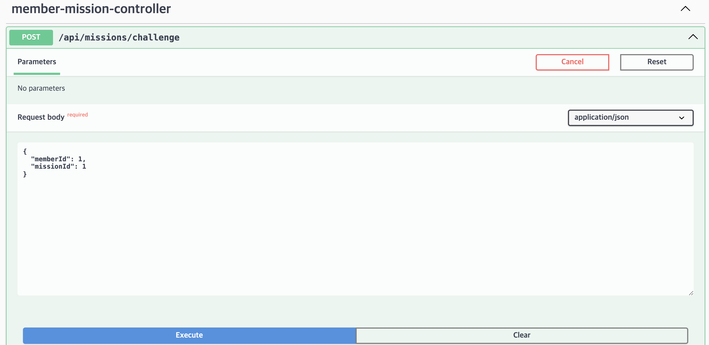

# 1. 특정 지역에 가게 추가하기 API

임의로 db에 region value를 1개만 넣어서 실행

`INSERT INTO region (name) VALUES ('서울시');`

- 정상적인 200 성공이 나옴
### **regionId == 2를 넣었을때**

- db에 1개의 region 데이터만 넣었으므로 500에러 확인 가능

# 2. 가게에 리뷰 추가하기 API
- 임의로 sql문을 활용하여 데이터 삽입(store, member)
- storeId = 1 , "memberId": 1로 설정했을때 200 및 성공 코드 뜸
- 
- 
- storeId = 1 , "memberId": 0로 설정했을때 400에러 및 "message": "사용자가 없습니다.” 뜸

- storeId = 0 , "memberId": 1로 설정했을때 400에러 및 "message": "해당 가게를 찾을 수 없습니다.” 

# 4. 가게의 미션을 도전 중인 미션에 추가(미션 도전하기) API 
- "memberId": 1, "missionId": 1 첫번째 실행 시 o

- "memberId": 0, "missionId": 1 : "message": "사용자 정보가 없습니다.”

-  "memberId": 1,"missionId": 0 ⇒ "message": "해당 미션을 찾을 수 없습니다.”

# 데이터베이스에 추가한 쿼리 모음
'''
    INSERT INTO food_category (name) VALUES
    ('한식'),
    ('일식'),
    ('중식'),
    ('양식'),
    ('치킨'),
    ('분식'),
    ('고기/구이'),
    ('도시락'),
    ('야식(족발, 보쌈)'),
    ('패스트푸드'),
    ('디저트'),
    ('아시안푸드');
    
    INSERT INTO region (name) VALUES ('서울시');
    
    INSERT INTO store (
    name,
    address,
    score,
    region_id,
    created_at,
    updated_at
    ) VALUES (
    '테스트 스토어',                -- name
    '서울특별시 강남구 역삼동 123-45',  -- address
    0.0,                            -- score (초기값)
    1,                              -- region_id (존재하는 region)
    NOW(),                          -- created_at
    NOW()                           -- updated_at
    );
    
    INSERT INTO member (
    address, email, gender, inactive_date, name,
    point, social_type, spec_address, status, created_at, updated_at
    ) VALUES (
    '서울 강남구 역삼동 123-45',
    'test@example.com',
    'MALE',
    NULL,
    '홍길동',
    0,
    'KAKAO',        -- 이 값이 허용되도록 테이블 변경 후
    '2층',
    'ACTIVE',
    NOW(),
    NOW()
    );
    
    INSERT INTO mission (reward, deadline, mission_spec, store_id, created_at, updated_at)
    VALUES (100, '2025-12-31', '테스트 미션 설명', 1, NOW(), NOW());
    
    INSERT INTO member_mission (member_id, mission_id, status, created_at, updated_at)
    VALUES (1, 1, 'CHALLENGING', NOW(), NOW());
    
    DELETE FROM member_mission WHERE member_id=1 AND mission_id=1;

> **github 링크**
>
>
> [https://github.com/Seona12/UMC_mission08/issues?q=is%3Aissue state%3Aclosed](https://github.com/Seona12/UMC_mission08/issues?q=is%3Aissue%20state%3Aclosed)
>