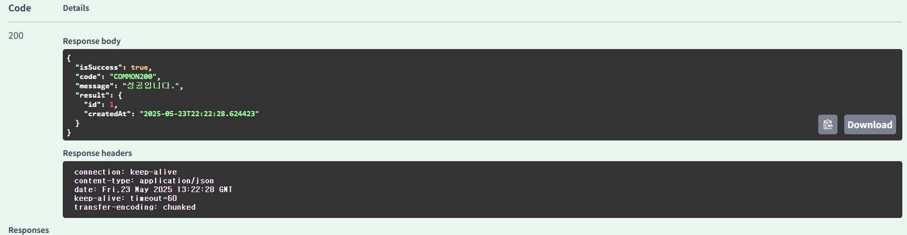

# ERD


1번인 ‘특정 지역에 가게 추가하기 API’는 내가 설계한 ERD에서 ‘Region’ 테이블이 없어서 패스하였다.

### 가게에 리뷰 추가하기 API


이미지는 제외하였다.

1. requestDTo, responseDTO

```java
@Getter
    public static class joinDto{
        Long userId;
        Long restaurantId;
        String contents;
        Double rate;
    }
```

```java
@Builder
    @Getter
    @NoArgsConstructor
    @AllArgsConstructor
    public static class JoinResultDTO{
        Long id;
        LocalDateTime createdAt;
    }
```

1. ReviewConverter

```java
public static ReviewResponse.JoinResultDTO toJoinResultDTO(Review review){
        return ReviewResponse.JoinResultDTO.builder()
                .id(review.getUserId().getId())
                .createdAt(LocalDateTime.now())
                .build();
    }

    public static Review toReview(ReviewRequest.joinDto request) {
        return Review.builder()
                .contents(request.getContents())
                .rate(request.getRate())
                .build();
    }
```

1. ReviewRestController

```java
@RestController
@RequiredArgsConstructor
@RequestMapping("/restaurants")
@Validated
public class ReviewRestController {
    private final ReviewCommandService reviewCommandService;

    @PostMapping("/{restaurantId}/reviews")
    public ApiResponse<ReviewResponse.JoinResultDTO> join(@RequestBody @Valid ReviewRequest.joinDto request) {
        Review review = reviewCommandService.joinReview(request, request.getUserId(), request.getRestaurantId());
        return ApiResponse.onSuccess(ReviewConverter.toJoinResultDTO(review));
    }
}
```

1. ReviewService

```java

@Service
@RequiredArgsConstructor
public class ReviewCommandServiceImpl implements ReviewCommandService {
    private final ReviewRepository reviewRepository;
    private final UserRepository userRepository;
    private final RestaurantsRepository restaurantsRepository;

    @Override
    public Review joinReview(ReviewRequest.joinDto request, Long userId, Long restaurantId) {
        Review newReview = ReviewConverter.toReview(request);
        User user = userRepository.findById(userId)
                .orElseThrow(() -> new TempHandler(ErrorStatus.MEMBER_NOT_FOUND));
        Restaurants restaurant = restaurantsRepository.findById(restaurantId)
                .orElseThrow(() -> new TempHandler(ErrorStatus.RESTAURANT_NOT_FOUND));
        newReview.setUserId(user);
        newReview.setRestaurantId(restaurant);

        return reviewRepository.save(newReview);
    }
}
```

1. annotation & validation

```java
@Documented
@Constraint(validatedBy = RestaurantExistValidator.class)
@Target( {ElementType.METHOD, ElementType.FIELD, ElementType.PARAMETER, ElementType.TYPE_USE} )
@Retention(RetentionPolicy.RUNTIME)
public @interface ExistRestaurant {
    String message() default "해당하는 가게가 존재하지 않습니다.";
    Class<?>[] groups() default {};
    Class<? extends Payload>[] payload() default {};
}
```

```java
@Component
@RequiredArgsConstructor
public class RestaurantExistValidator implements ConstraintValidator<ExistRestaurant, Long> {

    private final RestaurantsCommandService restaurantsCommandService;

    @Override
    public void initialize(ExistRestaurant constraintAnnotation) {
        ConstraintValidator.super.initialize(constraintAnnotation);
    }

    @Override
    public boolean isValid(Long storeId, ConstraintValidatorContext context) {
        boolean isValid = restaurantsCommandService.isRestaurantsExist(storeId);

        if (!isValid) {
            context.disableDefaultConstraintViolation();
            context.buildConstraintViolationWithTemplate(
                    ErrorStatus.RESTAURANT_NOT_FOUND.toString()).addConstraintViolation();
        }
        return isValid;
    }
}
```

**결과**





### 가게에 미션 추가하기 API


1. missionRequestDTO, missionResponseDTO

```java
@Getter
    public static class joinDto{
        Long restaurantId;
        String title;
        String contents;
        String phone;
    }
```

```java
@Builder
    @Getter
    @NoArgsConstructor
    @AllArgsConstructor
    public static class JoinResultDTO{
        Long id;
        LocalDateTime createdAt;
    }
```

1. MissionConverter

```java
public static MissionResponse.JoinResultDTO toJoinResultDTO(Mission mission){
        return MissionResponse.JoinResultDTO.builder()
                .id(mission.getId())
                .createdAt(LocalDateTime.now())
                .build();
    }

    public static Mission toMission(MissionRequest.joinDto request) {
        return Mission.builder()
                .title(request.getTitle())
                .contents(request.getContents())
                .phone(request.getPhone())
                .build();
    }
```

1. MissionRestController

```java
@RestController
@RequiredArgsConstructor
@RequestMapping("/restaurants")
@Validated
public class MissionRestController {
    private final MissionCommandService missionCommandService;

    @PostMapping("/{restaurantId}/missions")
    public ApiResponse<MissionResponse.JoinResultDTO> join(@RequestBody @Valid MissionRequest.joinDto request) {
        Mission mission = missionCommandService.joinMission(request, request.getRestaurantId());
        return ApiResponse.onSuccess(MissionConverter.toJoinResultDTO(mission));
    }
}
```

1. MissionService

```java
@Service
@RequiredArgsConstructor
public class MissionCommandServiceImpl implements MissionCommandService {
    private final MissionRepository missionRepository;
    private final RestaurantsRepository restaurantsRepository;

    @Override
    public Mission joinMission(MissionRequest.joinDto request, Long restaurantId) {
        Mission newMission = MissionConverter.toMission(request);
        Restaurants restaurant = restaurantsRepository.findById(restaurantId)
                .orElseThrow(() -> new TempHandler(ErrorStatus.RESTAURANT_NOT_FOUND));
        newMission.setRestaurantId(restaurant);

        return missionRepository.save(newMission);
    }
}
```

**결과**


### **가게의 미션을 도전 중인 미션에 추가(미션 도전하기) API**


1. addChallengeResponseDTO

```java
@Getter
    @Builder
    @AllArgsConstructor
    @NoArgsConstructor
    public static class AddChallengeResponseDto{
        Long id;
        MissionState state;
        LocalDateTime createdAt;
    }
```

1. AddChallengeConverter

```java
public static AddChallengeResponse.AddChallengeResponseDto toAddChallengeResultDto(UserMission userMission) {
        return AddChallengeResponse.AddChallengeResponseDto.builder()
                .id(userMission.getId())
                .state(userMission.getState())
                .createdAt(LocalDateTime.now())
                .build();
    }
```

1. AddChallengeRestController

```java
@PostMapping("/userMissions/{userId}/mission")
    public ApiResponse<AddChallengeResponse.AddChallengeResponseDto> addChallenge(
            @PathVariable Long userId) {
        Long missionId = 1L;
        UserMission userMission = missionCommandService.addChallenge(userId, missionId);
        return ApiResponse.onSuccess(MissionConverter.toAddChallengeResultDto(userMission));
    }
```

1. AddChallengeService

```java
@Transactional
    @Override
    public UserMission addChallenge(Long userId, Long missionId) {
        User user = userRepository.findById(userId)
                .orElseThrow(() -> new TempHandler(ErrorStatus.MEMBER_NOT_FOUND));
        Mission mission = missionRepository.findById(missionId)
                .orElseThrow(() -> new TempHandler(ErrorStatus.MISSION_NOT_FOUND));
        UserMission newUserMission = UserMission.builder()
                .state(MissionState.INPROGRESS)
                .build();
        newUserMission.setUserId(user);
        newUserMission.setMissionId(mission);

        return userMissionRepository.save(newUserMission);
    }
```

1. annotation & validation

```java
@Documented
@Constraint(validatedBy = ChallengeableMissionValidator.class)
@Target( {ElementType.METHOD, ElementType.FIELD, ElementType.PARAMETER} )
@Retention(RetentionPolicy.RUNTIME)
public @interface ChallengeableMission {
    String message() default "이미 도전중이거나, 완료한 미션입니다.";
    Class<?>[] groups() default {};
    Class<? extends Payload>[] payload() default {};
}
```

```java
@Component
@RequiredArgsConstructor
public class ChallengeableMissionValidator implements ConstraintValidator<ChallengeableMission, Long> {

    private final MissionCommandService missionCommandService;
    private final MissionQueryService missionQueryService;

    @Override
    public void initialize(ChallengeableMission constraintAnnotation) {
        ConstraintValidator.super.initialize(constraintAnnotation);
    }

    @Override
    public boolean isValid(Long missionId, ConstraintValidatorContext context) {
        Long userId = 1L;

        boolean isValid = missionQueryService.isMissionChallengeable(userId, missionId);

        if (!isValid) {
            context.disableDefaultConstraintViolation();
            context.buildConstraintViolationWithTemplate(
                    ErrorStatus.ALREADY_CHALLENGED_MISSION.toString()).addConstraintViolation();
        }
        return isValid;
    }
}
```

**결과**


