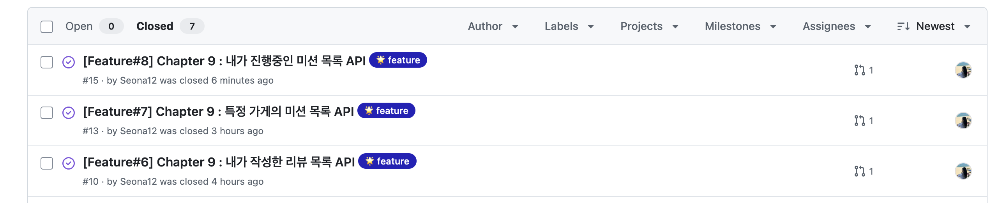

> **github 링크**
>
>
> https://github.com/Seona12/UMC_mission08/issues?q=is%3Aissue%20state%3Aclosed
>
@PageParam 어노테이션 구현

# api 앤드포인트 참고

1. 내가 작성한 리뷰 목록 : [**/api/users/{userId}/reviews**](http://localhost:8080/swagger-ui/index.html#/user-review-controller/getUserReviews)
2. 특정 가게의 미션 목록  : [**/api/stores/{storeId}/missions**](http://localhost:8080/swagger-ui/index.html#/store-mission-controller/getStoreMissions)
3. 내가 진행중인 미션 목록 : [**/api/users/{userId}/missions/in-progress**](http://localhost:8080/swagger-ui/index.html#/member-mission-controller-url/getInProgressMissions)