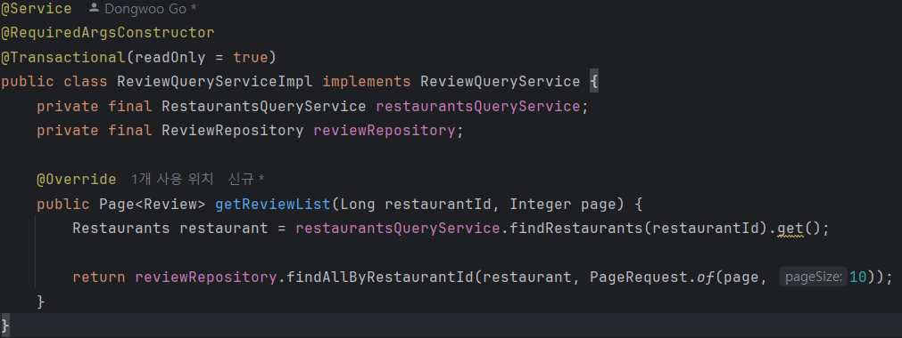
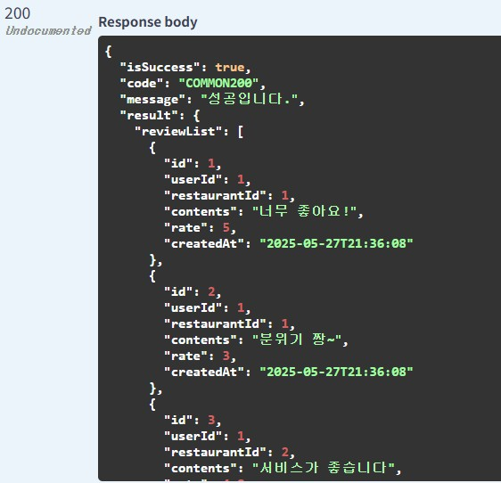
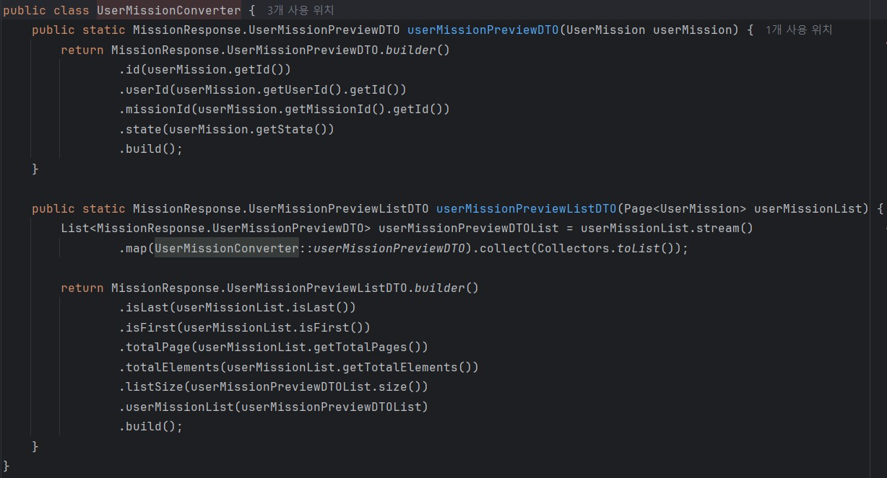

# 1. 내가 작성한 리뷰 목록

## Review 목록 DTO

## ReviewConverter

## UserRestController

## ExistUser

## UserExistValidator

## UserCommandService + Impl

## Page1Based annotation 

## Page1BasedValidator

## WebConfig

## ReviewQueryService + Impl

## Swagger

## 결과

# 2. 특정 가게의 미션 목록

## Mission 목록 DTO

## MissionConverter

## MissionRestController

## MissionQueryService + Impl

## MissionRespository

## Swagger

## 결과

# 3. 내가 진행중인 미션 목록

## 내가 진행중(INPROGRESS)인 Mission 목록 DTO

## UserMissionConverter

## 진행중인 미션 조회 UserRestControlle

## UserMissionQuery + Impl

## UserMissionRepository

## Swagger

## 결과

# 4. 진행 중인 미션을 미션 완료로 바꾸기

## 업데이트된 Mission DTO

## UserMissionConverter

## MissionRestController

## UserMissionCommandService + Impl

## Swagger

## 결과

