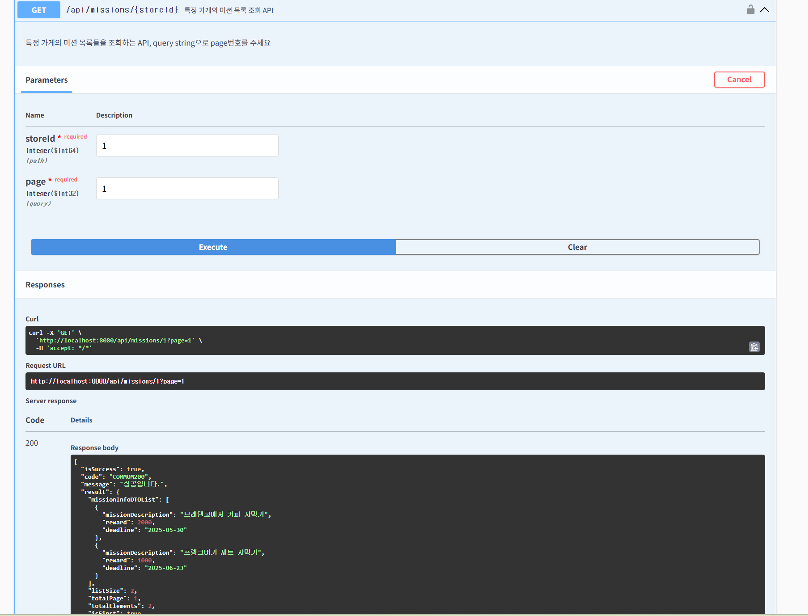

# 미션

<aside>

**조건**

- 로그인 회원가입 로직이 완성되지 않아 memberId는 쿼리 파라미터로 받음
- page는 1부터 시작 / page size는 10으로 고정
- 커스텀 어노테이션을 통해 page가 0이하일 경우 에러 반환

| 조건 | 처리 방식 |
| --- | --- |
| page≥1 | 내부에서 page-로 변환해서 사용 |
| page<1 | 에러 |
</aside>


## 1. 내가 작성한 리뷰 목록
GET /api/reviews?memberId={memberId}&page={page}

- dto

    ```java
        // 리뷰의 정보들의 목록
        @Builder
        @Getter
        @NoArgsConstructor
        @AllArgsConstructor
        public static class ReviewPreViewListDTO{
            List<ReviewPreViewDTO> reviewList;
            Integer listSize;
            Integer totalPage;
            Long totalElements;
            Boolean isFirst;
            Boolean isLast;
        }
    
        // 리뷰 정보
        @Builder
        @Getter
        @NoArgsConstructor
        @AllArgsConstructor
        public static class ReviewPreViewDTO{
            String ownerNickname;
            Float score;
            String body;
            LocalDate createdAt;
        }
    ```

- converter

    ```java
    // Review Entity를 ReviewPreViewDTO로 변환
        public static ReviewResponseDTO.ReviewPreViewDTO toReviewPreviewDTO(Review review){
            return ReviewResponseDTO.ReviewPreViewDTO.builder()
                    .ownerNickname(review.getMember().getName())
                    .score(review.getScore())
                    .createdAt(review.getCreatedAt().toLocalDate())
                    .body(review.getBody())
                    .build();
        }
    
        // Review 리스트 전체를 ReviewPreViewListDTO로 변환
        public static ReviewResponseDTO.ReviewPreViewListDTO toReviewPreViewListDTO(Page<Review> reviewList){
            List<ReviewResponseDTO.ReviewPreViewDTO> reviewPreViewDTOList = reviewList.stream()
                    .map(ReviewConverter::toReviewPreviewDTO).collect(Collectors.toList());
    
            return ReviewResponseDTO.ReviewPreViewListDTO.builder()
                    .isLast(reviewList.isLast())
                    .isFirst(reviewList.isFirst())
                    .totalPage(reviewList.getTotalPages())
                    .totalElements(reviewList.getTotalElements())
                    .listSize(reviewPreViewDTOList.size())
                    .reviewList(reviewPreViewDTOList)
                    .build();
        }
    ```

- controller

    ```java
    // memberId와 page를 쿼리 파라미터로 받는 리뷰 조회
        @GetMapping("")
        @Operation(summary="특정 회원이 작성한 리뷰 목록 조회 API", description = "특정 회원이 작성한 리뷰 목록들을 조회하는 API, query string으로 page번호와 memberId 주세요")
        public ApiResponse<ReviewResponseDTO.ReviewPreViewListDTO> getReviewsByUser(@ValidPage @RequestParam(name = "page") Integer page, @ExistMember @RequestParam(name="memberId") Long memberId){
            Page<Review> reviewList =  reviewQueryService.getReviewsByUser(memberId,page);
            return ApiResponse.onSuccess(reviewConverter.toReviewPreViewListDTO(reviewList));
        }
    ```

- service

    ```java
        @Override
        public Page<Review> getReviewsByUser(Long memberId, Integer page) {
            Member member = memberRepository.findById(memberId)
                    .orElseThrow();
            Page<Review> reviewPage = reviewRepository.findAllByMember(member,PageRequest.of(page-1,10));
            return reviewPage;
        }
    ```

- validator

    ```java
    @Component
    @RequiredArgsConstructor
    public class ValidPageValidator implements ConstraintValidator<ValidPage, Integer> {
    
        @Override
        public void initialize(ValidPage constraintAnnotation) {
            ConstraintValidator.super.initialize(constraintAnnotation);
        }
    
        @Override
        public boolean isValid(Integer value, ConstraintValidatorContext context) {
    
            if (value == null || value < 1) {
                context.disableDefaultConstraintViolation();
                context.buildConstraintViolationWithTemplate(ErrorStatus.PAGE_NUMBER_INVALID.toString()).addConstraintViolation();
    
                return false;
            }
            return true;
        }
    }
    
    ```

- 결과


## 2. 특정 가게의 미션 목록
GET /api/member-missions?memberId={memberId}&page={page}&status={status}

- dto

    ```java
        @Getter
        @Builder
        @NoArgsConstructor
        @AllArgsConstructor
        public static class MissionInfoDTO{
            private String storeName;
            private String missionDescription;
            private Integer reward;
            private LocalDate deadline;
        }
    
        @Getter
        @Builder
        @NoArgsConstructor
        @AllArgsConstructor
        public static class MissionInfoListDTO{
            List<MissionInfoDTO> missionInfoDTOList;
            Integer listSize;
            Integer totalPage;
            Long totalElements;
            Boolean isFirst;
            Boolean isLast;
    
        }
    ```

- converter

    ```java
        public static MemberMissionResponseDTO.MissionInfoDTO missionInfoDTO(Mission mission, Store store){
            return MemberMissionResponseDTO.MissionInfoDTO.builder()
                    .storeName(store.getName())
                    .missionDescription(mission.getMissionDescription())
                    .reward(mission.getReward())
                    .deadline(mission.getDeadline())
                    .build();
        }
    
        public static MemberMissionResponseDTO.MissionInfoListDTO missionInfoListDTO(Page<MemberMission> memberMissionList){
            List<MemberMissionResponseDTO.MissionInfoDTO> missionInfoDTOList = memberMissionList.stream()
                    .map(mm -> MemberMissionConverter.missionInfoDTO(mm.getMission(), mm.getMission().getStore()))
                    .collect(Collectors.toList());
    
            return MemberMissionResponseDTO.MissionInfoListDTO.builder()
                    .missionInfoDTOList(missionInfoDTOList)
                    .listSize(missionInfoDTOList.size())
                    .totalPage(memberMissionList.getTotalPages())
                    .totalElements(memberMissionList.getTotalElements())
                    .isFirst(memberMissionList.isFirst())
                    .isLast(memberMissionList.isLast())
                    .build();
        }
    ```

- controller

    ```java
        // 내가 진행중인 미션 목록 조회
        @GetMapping("")
        @Operation(summary="특정 회원의 미션 목록 조회 API", description = "특정 회원의 미션을 조회하는 API 이며 query string으로 memberId, page, status를 주세요")
        public ApiResponse<MemberMissionResponseDTO.MissionInfoListDTO> getMissionInfo(
                @ExistMember @RequestParam(name="memberId")Long memberId, @ValidPage @RequestParam(name = "page") Integer page , @RequestParam(name="status") MissionStatus status){
            Page<MemberMission> memberMissionList = memberMissionCommandService.getMissionsByMemberAndStatus(memberId, page, status);
            return ApiResponse.onSuccess(MemberMissionConverter.missionInfoListDTO(memberMissionList));
        }
    ```

- service

    ```java
        // 내가 진행중인 미션 목록 조회
        @Override
        public Page<MemberMission> getMissionsByMemberAndStatus(Long memberId, Integer page, MissionStatus status) {
            Member member = memberRepository.findById(memberId)
                    .orElseThrow();
    
            Page<MemberMission> memberMissionPage = memberMissionRepository.findAllByMemberAndStatus(member, status,PageRequest.of(page-1,10));
            return memberMissionPage;
        }
    ```
- 결과



## 3. 나의 미션 목록 (진행중/진행완료)
GET /api/member-missions?memberId={memberId}&page={page}&status={status}

- dto

    ```java
        @Getter
        @Builder
        @NoArgsConstructor
        @AllArgsConstructor
        public static class MissionInfoDTO{
            private String storeName;
            private String missionDescription;
            private Integer reward;
            private LocalDate deadline;
        }
    
        @Getter
        @Builder
        @NoArgsConstructor
        @AllArgsConstructor
        public static class MissionInfoListDTO{
            List<MissionInfoDTO> missionInfoDTOList;
            Integer listSize;
            Integer totalPage;
            Long totalElements;
            Boolean isFirst;
            Boolean isLast;
    
        }
    ```

- converter

    ```java
        public static MemberMissionResponseDTO.MissionInfoDTO missionInfoDTO(Mission mission, Store store){
            return MemberMissionResponseDTO.MissionInfoDTO.builder()
                    .storeName(store.getName())
                    .missionDescription(mission.getMissionDescription())
                    .reward(mission.getReward())
                    .deadline(mission.getDeadline())
                    .build();
        }
    
        public static MemberMissionResponseDTO.MissionInfoListDTO missionInfoListDTO(Page<MemberMission> memberMissionList){
            List<MemberMissionResponseDTO.MissionInfoDTO> missionInfoDTOList = memberMissionList.stream()
                    .map(mm -> MemberMissionConverter.missionInfoDTO(mm.getMission(), mm.getMission().getStore()))
                    .collect(Collectors.toList());
    
            return MemberMissionResponseDTO.MissionInfoListDTO.builder()
                    .missionInfoDTOList(missionInfoDTOList)
                    .listSize(missionInfoDTOList.size())
                    .totalPage(memberMissionList.getTotalPages())
                    .totalElements(memberMissionList.getTotalElements())
                    .isFirst(memberMissionList.isFirst())
                    .isLast(memberMissionList.isLast())
                    .build();
        }
    ```

- controller

    ```java
        // 내가 진행중인 미션 목록 조회
        @GetMapping("")
        @Operation(summary="특정 회원의 미션 목록 조회 API", description = "특정 회원의 미션을 조회하는 API 이며 query string으로 memberId, page, status를 주세요")
        public ApiResponse<MemberMissionResponseDTO.MissionInfoListDTO> getMissionInfo(
                @ExistMember @RequestParam(name="memberId")Long memberId, @ValidPage @RequestParam(name = "page") Integer page , @RequestParam(name="status") MissionStatus status){
            Page<MemberMission> memberMissionList = memberMissionCommandService.getMissionsByMemberAndStatus(memberId, page, status);
            return ApiResponse.onSuccess(MemberMissionConverter.missionInfoListDTO(memberMissionList));
        }
    ```

- service

    ```java
        // 내가 진행중인 미션 목록 조회
        @Override
        public Page<MemberMission> getMissionsByMemberAndStatus(Long memberId, Integer page, MissionStatus status) {
            Member member = memberRepository.findById(memberId)
                    .orElseThrow();
    
            Page<MemberMission> memberMissionPage = memberMissionRepository.findAllByMemberAndStatus(member, status,PageRequest.of(page-1,10));
            return memberMissionPage;
        }
    ```
- 결과


>깃허브 링크 | https://github.com/sunninz/UMC-Spring-Study/tree/feat/week9


# 시니어 미션

https://velog.io/@sunnin/UMC-JPA-페이징-처리-Page와-Slice는-무엇이-다를까

https://velog.io/@sunnin/UMC-Java-컬렉션-반복-처리-방식-for문과-Stream-비교-분석
