email 대신 username(아이디)으로 미션을 진행했습니다.

## 실습 1
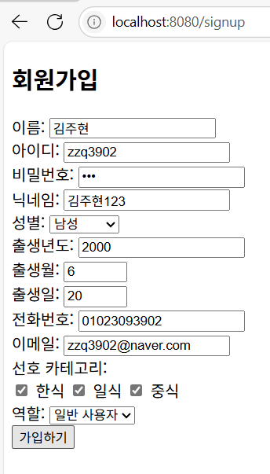

다음과 같이 회원 정보를 입력한 뒤 회원 가입을 완료하면

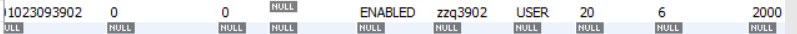

데이터베이스에 회원이 생성된다.

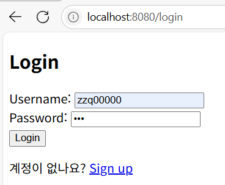

만약 가입하지 않은 정보로 로그인할 경우,

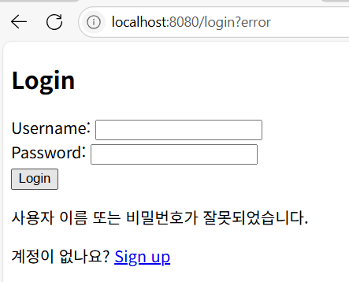

에러 메시지가 출력되며, 다시 로그인 폼으로 돌아온다.

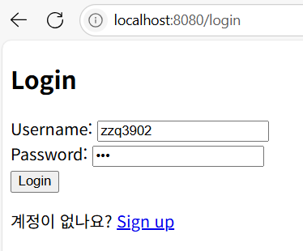

가입되어 있는 정보로 로그인을 하면

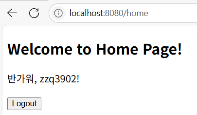

홈페이지로 이동한다.

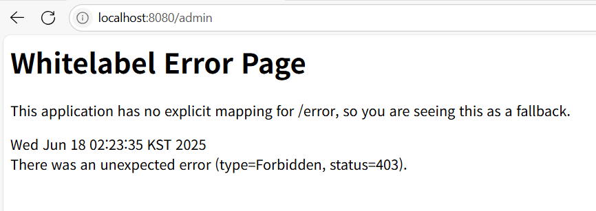

일반 사용자로 가입을 했으므로 admin 페이지의 접근은 제한된다.

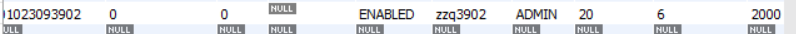

Role을 ADMIN으로 변경하면 admin 페이지 접근이 가능해진다.

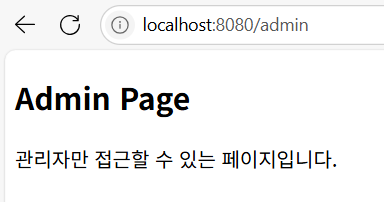

## 실습 2

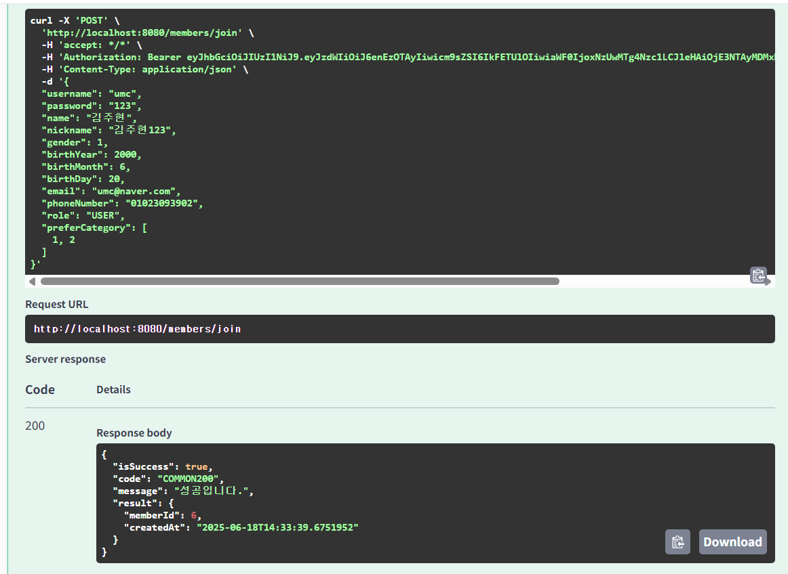

아이디, 비밀번호, 이름 등의 회원 정보를 입력한 후 실행하면 회원 가입이 완료된다.

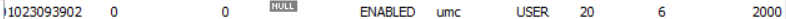

다음과 같이 db에도 저장된 것을 확인했다.

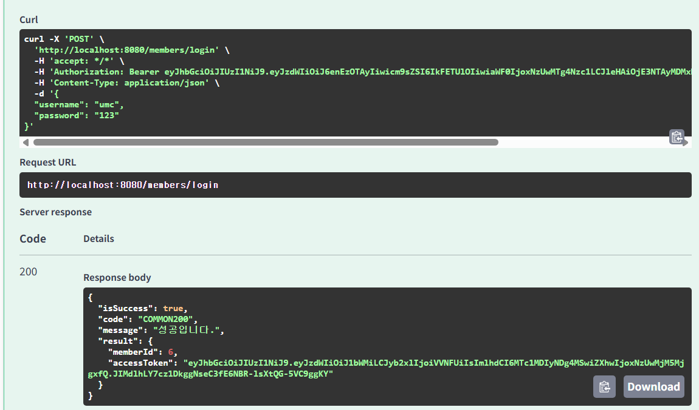

가입한 회원 정보로 로그인을 시도하면 성공 메시지가 반환되며 accessToken이 발급된다.

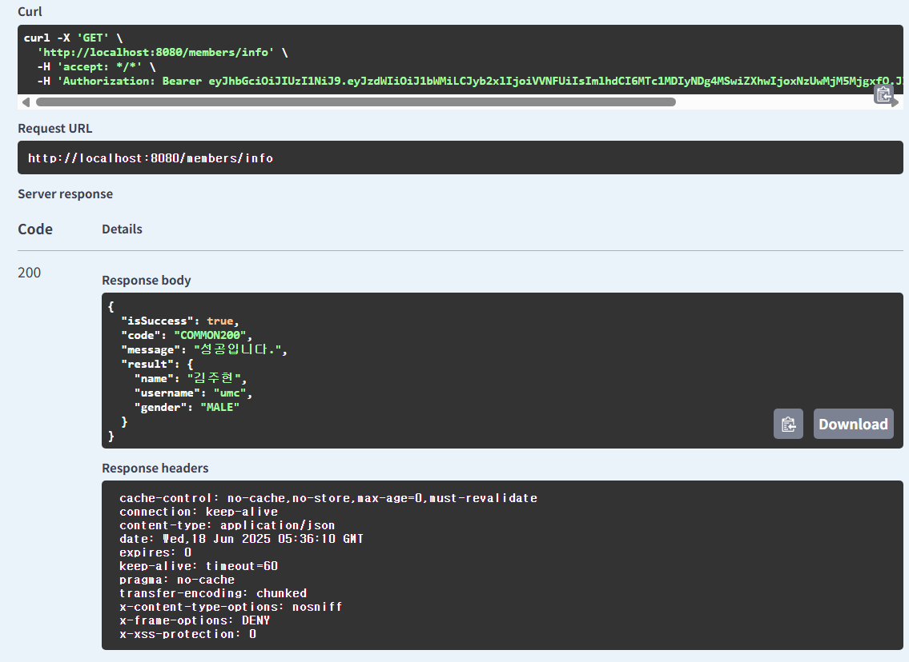

발급받은 토큰을 Authorization에 입력한 뒤 회원 정보를 조회하면 알맞은 정보가 출력된다.