### 실습 1. 간단한 로그인 및 회원가입 구현 - Session 방식

**유저 회원가입**

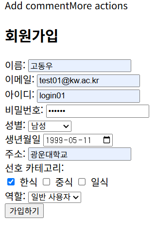

**DB 회원가입 확인**

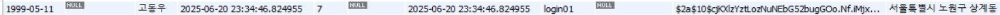

**유저 로그인**

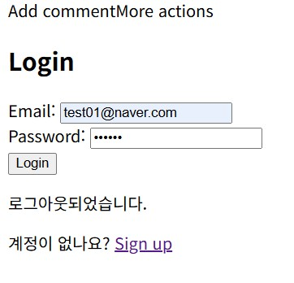

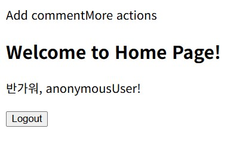

**유저 권한 확인**

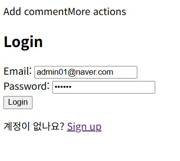

### 실습 2. 간단한 로그인 및 회원가입 구현 - JWT Token 방식
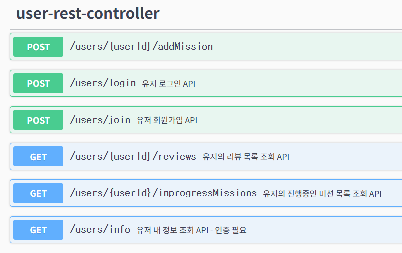

**유저 회원가입**

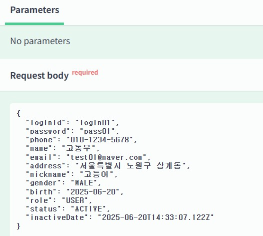

**유저 로그인**

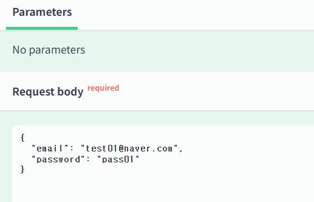

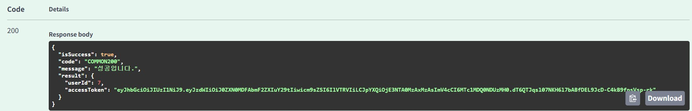

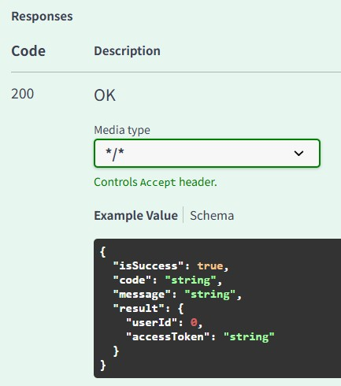

**유저 로그인 정보 가져오기**

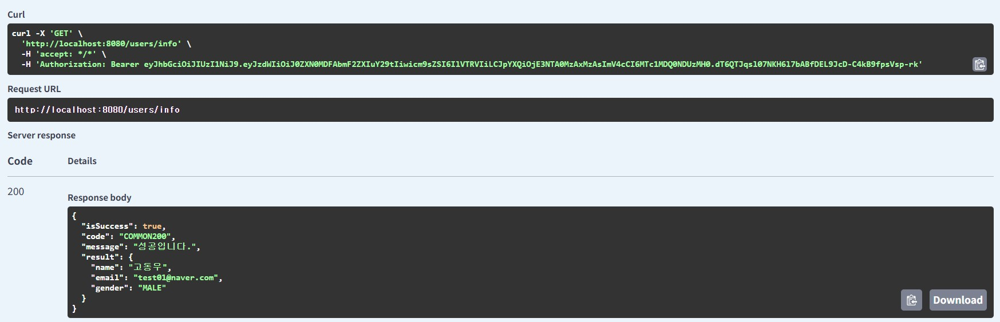

> **GitHub 저장소 주소**
>
>
> https://github.com/DwKwCs/UMC_study_JPA/tree/feature/week10
>