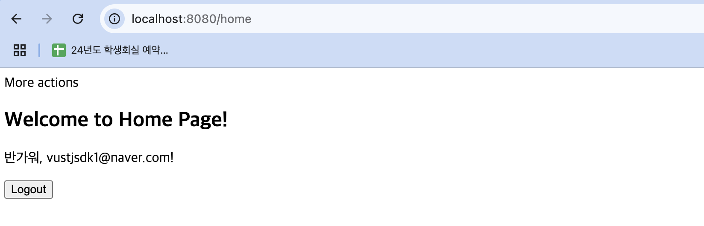

> **GitHub 저장소 주소**
>
>
> https://github.com/Seona12/UMC_mission08/tree/Feature/%238
> feature#8 브랜치에서 실습하였습니다
> 
# 실습 1: Spring Security를 활용한 로그인 및 회원가입 구현 = Session 방식

html 페이지에서 데이터 추가 후 인텔리제이 로그 및 datagrip에서 데이터 추가 되는 내용 확인 후, role을 admin으로 변경하여 로그인 및 로그아웃, 관리자페이지 이동까지 확인하였습니다.

# 실습 2: Spring Security를 활용한 로그인 및 회원가입 구현 = JWT 방식

- 회원 로그인

- 회원정보 조회

스웨거에서 members/join 앤드포인트에서 request body 넣어 회원가입 한 후, members/login 앤드포인트에서 성공 메시지 및 accesstoken 확인, 확인 후 인증 부분에 넣어서 회원정보 조회까지 확인 완료